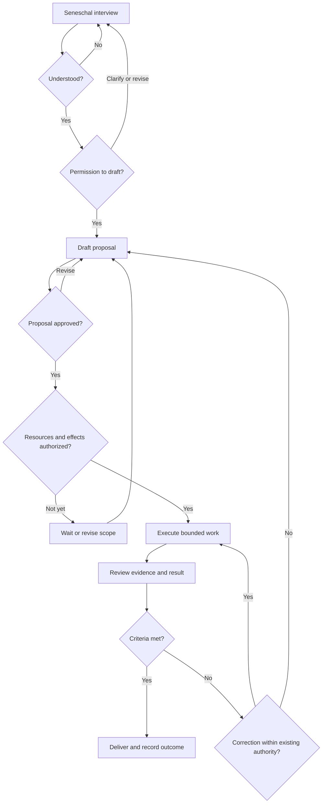

# Imperium — Institutional and Mission Flow

Date: 24 September 2026 (UTC)  
Companion: [IMPERIUM-STEPS.md](IMPERIUM-STEPS.md)

## 1. Scope and status

This document translates the supplied cognitive map and the restart decisions into an operational flow. It distinguishes retained doctrine from the proposed first implementation. It does not claim that the mapped offices or execution boundaries already run in the fresh Symfony application.

The map describes responsibilities and relationships. It is not a requirement to implement every box as an AI agent or every arrow as a network call.

## 2. Institutional responsibilities

| Place or office | Officer or role shown | Responsibility represented |
|---|---|---|
| Operator | Human operator | Supplies objectives and grants applicable approvals and resource authority. |
| Citadel | Institutional boundary | Contains Imperium's internal offices and shared institutional services. |
| Courtyard | Courtthane | Operational entrance and preparation for commissioning. |
| Curia | Seneschal, Isolde, Chamberlain, Curial Officers | Mission deliberation: Seneschal handles the interview and decisions; Isolde supports records/secretarial work; Chamberlain coordinates Curial work. |
| Oracle | Augur | Catalogs available models and supports informed model selection. |
| Hagiography | Sanctographer, Chroniclers | Human-trait canonization. |
| Foundry | Artificer | Persona construction. |
| Studium | Chancellor, Notaries | Governance doctrine. |
| Guildhall | Guildmaster, Craftsmen | Profession resolution and personnel suitability. |
| Garrison | Constable | Persona admission and custody. |
| Conscription | Recruiter | Profile commissioning and manifestation assembly. |
| Laboratorium | Alchemist | Profile elaboration; deterministic work belongs in deterministic services. |
| Senate | LordSpeaker, Senators | Independent examination and disposition. |
| Clavium | Locksmith | Credential custody responsibility. |
| Armory | Armorer | Tool/capability provision responsibility. |
| Atheneum | Archivist | Shared institutional records and memory. |
| Runtime | MasterMason | Bootstrap responsibility; exact minimal restart procedure remains to be specified when needed. |

The supplied map also labels a relationship near Curia and Guildhall as “Castellan.” Its exact runtime responsibility is not settled by that label alone; do not invent a new office or mandatory approval from it.

Not every mission needs to visit every office. A configured initial Seneschal can support the first interview without pretending that all later recruitment and establishment procedures have already occurred.

## 3. Atheneum — revised placement and responsibility

**Place Atheneum inside Citadel, with Archivist beneath it and no direct connection arrows.**

Map annotation:

> Shared institutional records and memory. All offices access it through authorized services.

The absence of arrows is a drawing convention for a shared service. It does not mean isolation or unrestricted access.

- Offices remain responsible for their decisions and competence.
- Offices submit defined acts or commands and request permitted information. They do not submit SQL or arbitrary database mutations.
- Atheneum's application services validate applicable access and record rules, persist changes, and provide retrieval and history.
- Doctrine ORM/DBAL supplies the underlying database implementation.
- Ordinary reads and writes are deterministic. Archivist is involved when archival judgment, interpretation, or investigation is needed.
- Atheneum keeps each fact's authoritative home clear; it need not duplicate every record into both general and office tables.
- Credential secrets remain under their designated custody. A historical permission recorded in Atheneum is not automatically current permission to act.

Current implementation uses small Atheneum services around interview and proposal records with Doctrine ORM. No separate server, universal event store, model-mediated database access, or comprehensive migration engine is required.

The former direct Atheneum–Barbican connection is removed from the map. Any future export of records is an explicit authorized operation, not an automatic consequence of shared storage access.

## 4. Entry and the interview

The institutional entry is **Operator → Courtyard → Curia**. Courtyard prepares entry; the mission interview belongs to Seneschal in Curia.

For the first implementation, these responsibilities may be served by one local command and a small number of services. A separate Courtthane model or full commissioning engine is not established as a prerequisite by this document.

Seneschal's interview has one objective: **“I understand.”** It should clarify what the operator wants, why material constraints matter, what a successful result looks like, and which unknowns could change the proposed work. It is a conversation, not a compulsory questionnaire with a fixed number of turns.

When satisfied, Seneschal asks:

> I am ready to draft a proposal. Do you approve?

Permission to draft is distinct from approval of the resulting proposal and from authorization to use resources or create external effects.

## 5. Mission flow

The following is the proposed operational sequence. State labels describe behavior; they are not a requirement to install a new workflow engine before the interview can run.



### Meaning of each stage

| Stage | Required behavior |
|---|---|
| Interview | Retain exchanges and material clarifications. Do not silently invent missing intent. |
| Proposal | Identify objective, steps, expected output, acceptance criteria, resource requirements, and limits. Keep items individually referenceable. |
| Approval | Record which proposal version the operator approved. Material revisions require reconsideration of the affected approval. |
| Authorization | Establish which resources and effects are allowed, by whom, and within what scope and limits. Approval alone does not imply it. |
| Execution | Enforce permissions in application code at the relevant operation. Track attempts and actual outcomes. |
| Review | Compare the result with the agreed criteria using available evidence. Model confidence alone is insufficient. |
| Delivery | Retain the deliverable, evidence references, known limitations, and completion/failure/partial disposition. |

An operator interaction may capture both proposal approval and resource authorization if it states both explicitly. They remain distinct facts; separate facts do not require repetitive prompts or separate screens.

An operator may pause or cancel the mission. Preserve the actual state and any completed effects. A restart or retry must not silently repeat an external effect. Recovery requirements should be implemented for the operation being introduced, rather than building every possible recovery mechanism in advance.

Missing authority means no execution. Reuse still-valid authority within its scope; request new authority when scope, resources, effects, or limits change.

## 6. External execution — retained map, deferred implementation

The supplied map places Barbican, Iron Gate, and Lazaretto within La Cortine, with the Theatre outside as the execution layer.

| Element | Relationship visible in the map | Implementation implication |
|---|---|---|
| Barbican | Connected to Clavium and Armory, and to the Theatre. | Define how the needed credentials/capabilities are supplied when the first relevant external tool is introduced. Revised Atheneum has no direct arrow here. |
| Iron Gate | Curia's outward route toward the Theatre. | Enforce the applicable execution authorization before an external effect. The precise mechanism follows the actual tool and trust boundary. |
| Theatre | External execution layer. | Perform authorized work and return its observed result. |
| Lazaretto | Return path from Theatre toward Curia; labeled sanitization ingress. | Validate and handle incoming material as external data. Returned content must not acquire authority merely by being received. |

These labels preserve the cognitive design. The restart has not yet specified full protocols for these boundaries. Build the protections needed by the first external operation before enabling it; do not claim the entire boundary system exists because its names appear in code.

## 7. Shared records throughout the flow

Atheneum supports the stages without becoming another deliberative step between them. Suggested initial records are:

| Record | Purpose |
|---|---|
| Interview | Identity, exchanges, current status, and resumable context. |
| Proposal | Identifiable versions of the proposed objective, plan, and criteria. |
| Approval and authorization | Who approved or authorized what, with references to the relevant version and scope. |
| Execution attempt | Operation, status, outcome, usage where available, and enough information for the selected recovery behavior. |
| Review and delivery | Assessment against criteria, deliverable references, and disposition. |

This is a logical list, not a mandated table-per-row schema. Add records when their feature is implemented. For the first interview, start with the interview and its exchanges.

## 8. Smallest implementation that demonstrates the doctrine

Start with one entry point, one configured Seneschal agent, and a small persistence service. Demonstrate clarification, permission to draft, and resumption. Proposal generation and review are implemented; proposal revision/approval is the current campaign. Resource/effect authorization, execution, and result review follow as later usable capabilities.

The implementation now follows this shape: `imperium:interview`, a named Symfony AI Seneschal agent using DeepSeek, and small Atheneum interview/proposal services using Doctrine ORM with PostgreSQL. The live path has reached persisted proposal review. The current campaign adds proposal revision as immutable new versions and explicit approval of the observed latest version. See [SENESCHAL-CLI.md](SENESCHAL-CLI.md) for setup, commands, limits, and validation status. Resource/effect authorization and execution are not implemented.

Symfony components provide the mechanics; Imperium defines the meaning and enforced boundaries. A prompt can guide Seneschal's behavior, but permissions and state transitions that protect real effects must be enforced by the application.

The first complete milestone is one useful mission delivered through this flow. Additional officers, automated selection, formal proceedings, and broader autonomy follow evidence of need.

## Basis and limits

This flow uses the cognitive map supplied in the conversation, the agreed Atheneum revision, and the restart's explicit decisions. The map establishes relationships but does not fully specify every office's powers or every protocol. Those details remain to be defined when necessary; missing detail is not permission to recreate the previous implementation by assumption.

Implementation status and repository evidence are recorded in [IMPERIUM-STEPS.md](IMPERIUM-STEPS.md).

*Ad Imperium.*

The CLI interview now requests one focused question at a time. Once ready,
Seneschal summarizes its understanding and the application asks for drafting
permission. The operator can correct that summary, decline, or explicitly approve.
A waiting message precedes reply requests; failures show a safe next step and retain
the input for explicit retry. This interaction also supports resuming a saved
interview that is awaiting a decision.

The CLI entrance now opens the saved-interview list. The operator chooses `new`
for a fresh mission or a numbered row for Continue/Delete. `--new` bypasses the
list; a full UUID resumes its existing interview directly.


## Current implementation checkpoint — 25 September 2026

The mission flow is implemented through the proposal decision gate:

```text
Interview
  → Understanding
  → Draft permission
  → Proposal v1
  → Review
      ↳ Request revision → Proposal v2/v3/...
      ↳ Approve latest version
```

Revisions preserve earlier proposal versions. Approval is a deterministic application
state transition against the observed latest version and is persisted separately from
drafting permission. Neither a proposal's listed resource requirements nor proposal
approval grant resource/effect authority. No execution path exists yet.

The proposal revision/approval campaign passes PostgreSQL CI with 39 tests / 341
assertions and full migration rollback/reapply. Live operator acceptance remains the
last campaign gate before merge.


## Authorization checkpoint — 25 September 2026

The implemented flow now reaches a separate authorization fact after proposal
approval:

```text
Approved proposal version
  → Prepare authorization request
      → snapshot proposal resource requirements
      → snapshot proposal limits
      → declare intended external effects
  → Authorize / Refuse
  → STOP (no execution action exists)
```

Authorization is deterministic application state, not model judgment. Reopening an
approved proposal does not create authority. A decided authorization is read-only.
External effects declared here do not amend the approved proposal; material changes
must return to proposal revision. Recording authorization performs no external effect.


## First bounded execution checkpoint — 26 September 2026

The current campaign extends the flow with one concrete, mechanically enforced
operation:

```text
Authorized proposal scope
  → verify filesystem-write capability
  → verify "create one local file" effect
  → persist PREPARED execution attempt
  → create one new file under public/output/
  → verify SHA-256
  → persist SUCCEEDED / FAILED evidence
```

There is no general execution router. One authorization is consumed by at most one
execution attempt, existing targets are not overwritten, and no model participates
in the authority check or filesystem effect. Interrupted prepared attempts are
reconciled by observation only; Imperium never silently repeats the effect.
