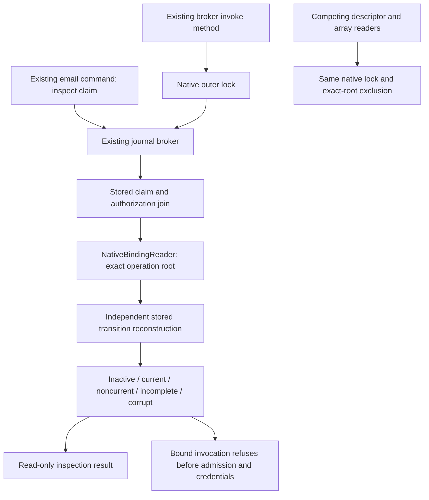

# Current continuation: reconciliation issuance authority and revocation-at-use remediation

`CANONICAL_NATIVE_EFFECT_RECONCILIATION_ISSUANCE_AUTHORITY_REVOCATION_REMEDIATION_READY`
`PREPARATION_BATCH_0_COMPLETE_RECONCILIATION_ISSUANCE_AUTHORITY_AND_REVOCATION_GAPS_CLASSIFIED`
`BATCH_1_COMPLETE_RECONCILIATION_ISSUANCE_AUTHORITY_CURRENTNESS_CONTRACTS_DEFINED`
`BATCH_2_NOT_AUTHORIZED`
`FORMAL_CLOSURE_REFUSED_RECONCILIATION_DERIVATION_AUTHORITY_ABSENT`
`REVOCATION_AT_CONSUMPTION_UNPROVED`
`BATCH_7_LIVE_TRIAL_AUTHORIZATION_SUSPENDED`

Preparation Batch 0 and Batch 1 are complete. Four stages remain. Batch 1 defines
versioned issuance-authority and at-use-currentness law through constants-only,
authority-empty contracts. It implemented, wired, created, consumed and
published no authority or operational evidence.

The campaign is
`docs/next-campaign-canonical-native-effect-reconciliation-issuance-authority-revocation-remediation.md`.
The current handoff is
`docs/handoffs/canonical-native-effect-reconciliation-issuance-authority-revocation-remediation-batch-1-complete.md`.
Both local-ready files are historical. Batch 2 and the suspended Batch 7 live
trial remain unauthorized.

# Current disposition: reconciliation authority provenance remediation

`CANONICAL_NATIVE_EFFECT_RECONCILIATION_AUTHORITY_PROVENANCE_REMEDIATION_COMPLETE`
`RECONCILIATION_AUTHORITY_PROVENANCE_ACCEPTED_BOUNDED_NO_LIVE_EFFECT`
`BATCH_7_LIVE_TRIAL_AUTHORIZATION_SUSPENDED`

Preparation Batch 0 and Batches 1–4 were separately committed and merged.
Batch 5 began from clean merged Batch 4 `main` at
`98ba984c7cb808bd2195b5637f61c079bd47a22f`. Caller-created authority arrays are
no longer admissible: the corridor resolves signed Operator Root/native
Imperator competence, immutable issuance evidence and exact process-local typed
custody before one atomic claim derivation. Claim-to-receipt consumption is
durable and receipt-to-Root reconstruction is read-only.

The corrected local full suite passed `2474 / 51016`. GitHub Actions run
`33874716024`, job `101028835208`, passed `2480 / 51049` on Ubuntu/PHP 8.4.25 for
exact terminal candidate merge `98f9777959efa279aa6f93e0e240fe861409cef1`.
Zero campaign stages remain. No provider edge was added and Batch 7 remains
suspended.

# Current disposition: native effect process custody and formal closure remediation

`CANONICAL_NATIVE_EFFECT_PROCESS_CUSTODY_FORMAL_CLOSURE_REMEDIATION_COMPLETE`
`PROCESS_CUSTODY_AND_FORMAL_CLOSURE_ACCEPTED_BOUNDED_NO_LIVE_EFFECT`
`BATCH_7_LIVE_TRIAL_AUTHORIZATION_SUSPENDED`

Preparation Batch 0 and Batches 1–4 are separately committed and merged through
clean-main merge `83fc4d6`. Actual PID plus issuer-private incarnation nonce and
exact object custody now refuse serialization, clone, fork/fresh-process and PID-
label substitution. First callback execution, read-only reconstruction and
claimed no-provider forward recovery are disjoint.

The separately sequenced Batch 5 audit recorded exact-candidate focused `80 /
692` and full `2371 / 50100` local PHPUnit proof. GitHub Actions run
`33826904446`, job `100881403332`, independently ran the full suite on Ubuntu /
PHP 8.4.25 for exact merge `c47adc531d1d6191b3e00f20f056ed69975289d2`
and passed `2371 / 50101`, including the supported Linux fork assertion. Zero
campaign stages remain. No provider edge is present and Batch 7 remains
suspended.

# Current continuation: native effect continuation and exclusivity remediation

`CANONICAL_NATIVE_EFFECT_CONTINUATION_EXCLUSIVITY_REMEDIATION_CAMPAIGN_READY`
`PREPARATION_BATCH_0_AUTHORIZED_ONLY`
`BATCH_7_LIVE_TRIAL_AUTHORIZATION_SUSPENDED`

The post-Batch 6 review retains the non-network corridor machinery only as
candidate substrate. It refuses progression to the live trial because a fresh
process can attempt first continuation from durable inputs, distinct authorities
for the same semantic effect acquire distinct locks, and receipt binding accepts
caller-supplied authority semantics without recomputing the seal. Preparation
Batch 0 now inventories those exact gaps and evidence provenance only.

See `docs/next-campaign-canonical-native-effect-continuation-exclusivity-remediation.md`,
`docs/canonical-native-effect-corridor-post-batch-6-blackquill-review-v1.md` and
`docs/handoffs/canonical-native-effect-continuation-exclusivity-remediation-preparation-batch-0-local-ready.md`.
No live marker can override the suspension before corrective proof and a separate
terminal Blackquill audit.
# Current continuation: canonical native effect corridor

`CANONICAL_NATIVE_EFFECT_CORRIDOR_ACTIVATION_CAMPAIGN_READY`
`PREPARATION_BATCH_0_AUTHORIZED_ONLY`
`LIVE_EFFECT_AUTHORITY_ABSENT`

Accepted native transition, canonical consumption and coherent inspection still
terminate before provider execution. Preparation Batch 0 now inventories the
missing effect-admission authority, capability-custody cut, effect-start journal,
unknown-outcome behavior, provider-response provenance, Lazaretto/receipt joins
and every competing bypass. It does not open the route or change mission flow.
See `docs/next-campaign-canonical-native-effect-corridor-activation.md` and
`docs/handoffs/canonical-native-effect-corridor-activation-preparation-batch-0-local-ready.md`.
A live effect requires a separately authorized Batch 7 and the exact marker
`AUTHORIZE_CANONICAL_NATIVE_EFFECT_LIVE_TRIAL_ONCE`.

# Current native-inspection corrective disposition

`NATIVE_INSPECTION_SNAPSHOT_CONSISTENCY_CORRECTED_CLOSURE_ACCEPTED`

The optimistic non-authorizing inspection candidate is admitted prospectively
after corrective Operator authorization and an external review of the exact
candidate commit. Its original unauthorized execution and invalid closure remain
preserved in the breach record; they are not rewritten as authorized history.
No mission-flow authority, credential access, provider effect, retry, Iron Gate
or Lazaretto permission follows from this correction. See
`docs/handoffs/native-inspection-snapshot-consistency-corrective-admission-complete.md`.

# Current continuation: native inspection snapshot consistency

`NATIVE_INSPECTION_SNAPSHOT_CONSISTENCY_CAMPAIGN_READY`
`PREPARATION_BATCH_0_AUTHORIZED_ONLY`

The next campaign is a bounded observability correction, not a mission-flow or
provider-effect expansion. The accepted journal-bound authorizing path already
holds native exclusion before its pre-effect decision. Preparation Batch 0 will
inventory unlocked read-only inspection callers and decide what consistency
claim can be proved under concurrent native publication, revocation, expiry,
migration and interruption. No runtime change, mission, credential, provider
operation, retry authority, Iron Gate opening or Lazaretto opening is authorized.
See `docs/next-campaign-native-inspection-snapshot-consistency.md` and
`docs/handoffs/native-inspection-snapshot-consistency-preparation-batch-0-local-ready.md`.

# Current canonical-consumer campaign status

`EXECUTABLE_ATOMIC_TRANSITION_CANONICAL_CONSUMER_INTEGRATION_CORRECTION_CAMPAIGN_COMPLETE`
`CANONICAL_CONSUMER_INTEGRATION_TERMINAL_AUDIT_ACCEPTED_BOUNDED_PRE_EFFECT`

Final full PHPUnit: **2019 tests / 46348 assertions**, passed.
Zero stages remain. Current handoff: `docs/handoffs/executable-atomic-transition-canonical-consumer-integration-correction-campaign-complete.md`.
Final inventory: `docs/executable-atomic-transition-canonical-consumer-integration-correction-inventory-v2.md`.
Terminal audit: `docs/executable-atomic-transition-canonical-consumer-integration-correction-terminal-audit-v1.md`.
Reading ledgers v1/v2/v3 record required, additional and final reviewed sources.
The established journal consumer and competing readers enforce native interpretation
or exact-root refusal; real container/application and process proof passed.
BOUND_INACTIVE, historical v3 NOT_IMPLEMENTED and UNKNOWN_REPLAY_PROHIBITED remain.
No live rollout, credential/provider operation, retry, Iron Gate or Lazaretto opening
is granted. Earlier statuses and authorization statements below are historical.

## Current bounded email consumer flow



The command only inspects. No edge proceeds from native currentness to provider
execution. Generic email requests without a binding root and the direct AgentMail
transport refuse. Distinct archival and cognition/Sortie flows are classified in
the terminal inventory rather than assigned this email meaning.

## Historical campaign ledger

Batch 3A audit corrections: `CANONICAL_CONSUMER_CORRECTION_BATCH_3A_COMPLETE`.
Schema-substitution and cached-result bypasses corrected; terminal review will restart from clean merged main. Handoff: `docs/handoffs/executable-atomic-transition-canonical-consumer-integration-correction-batch-3a-complete.md`.

Batch 3 application/adversarial proof complete: `CANONICAL_CONSUMER_CORRECTION_BATCH_3_COMPLETE`.
Current handoff: `docs/handoffs/executable-atomic-transition-canonical-consumer-integration-correction-batch-3-complete.md`. One stage remains: the separate terminal audit from clean merged Batch 3 main. Earlier stage entries below describe historical checkpoints and authorization; the operator has authorized campaign completion.

Batch 2 established-consumer integration complete: `CANONICAL_CONSUMER_CORRECTION_BATCH_2_COMPLETE`.
See `docs/handoffs/executable-atomic-transition-canonical-consumer-integration-correction-batch-2-complete.md`. Full PHPUnit passed 1994 tests / 45969 assertions. Application/adversarial proof and terminal audit remain pending.

Batch 1 interpretation complete: `CANONICAL_CONSUMER_CORRECTION_BATCH_1_COMPLETE`.
See `docs/handoffs/executable-atomic-transition-canonical-consumer-integration-correction-batch-1-complete.md`. Full PHPUnit: 1979 tests / 45874 assertions. Batch 2 integration and Batch 3 application proof remain pending; terminal refusal is not lifted.

# Delegate mission flow

Current: `NATIVE_INTEGRATION_TERMINAL_AUDIT_REFUSED_CANONICAL_CONSUMER_NOT_INTEGRATED`.
The post-terminal Blackquill review retains the bounded native transition
substrate but rejects canonical integration: the new command consumes its own
consumer/reader island while the established descriptor/effect corridors remain
separate. The corrective campaign is selected at
`EXECUTABLE_ATOMIC_TRANSITION_CANONICAL_CONSUMER_INTEGRATION_CORRECTION_CAMPAIGN_READY`.
Preparation Batch 0 is complete at
`PREPARATION_BATCH_0_COMPLETE_CANONICAL_CONSUMER_BYPASS_CLASSIFIED`.
Current handoff:
`docs/handoffs/executable-atomic-transition-canonical-consumer-integration-correction-preparation-batch-0-complete.md`.
Inventory: `docs/executable-atomic-transition-canonical-consumer-integration-correction-preparation-inventory-v1.md`.
Reading ledger: `docs/executable-atomic-transition-canonical-consumer-integration-correction-reading-ledger-v1.json`.
The eleven direct descriptor readers, array readers, generic executor and older
journal-bound email callback remain disconnected from native interpretation.
The retired AgentMail command remains closed. Distinct mission/DeepSeek/Sortie
meanings are classified from their call graphs. Four planned stages remain;
no Batch 1 implementation is authorized by preparation completion.
Historical selection entry:
`docs/handoffs/executable-atomic-transition-canonical-consumer-integration-correction-preparation-batch-0-local-ready.md`.
`BOUND_INACTIVE`, historical `NOT_IMPLEMENTED` and
`UNKNOWN_REPLAY_PROHIBITED` remain binding; no live rollout, provider effect,
retry, Iron Gate or Lazaretto opening is granted. The prior terminal acceptance,
test counts and stage entries below remain evidence for their historical tree,
not the current closure verdict.
Historical superseded marker:
`NATIVE_INTEGRATION_TERMINAL_AUDIT_ACCEPTED_BOUNDED_PRE_EFFECT`.

Latest: `NATIVE_INTEGRATION_BATCH_6_INDEPENDENT_RECONSTRUCTION_COMPLETE`; one stage remains.
Current handoff: `docs/handoffs/executable-atomic-transition-native-integration-remediation-batch-6-complete.md`.
Independent stored-edge verification gates the actual binding reader. Executable
Root grants bind the exact native production basis. The Symfony authority-id
command calls this chain. Terminal judgment follows clean local Batch 6 merge.
Earlier "Latest" entries below are historical batch checkpoints.

Latest: `NATIVE_INTEGRATION_BATCH_5_PROCESS_AND_INTERRUPTION_PROOF_COMPLETE`; two stages remain.
Current handoff: `docs/handoffs/executable-atomic-transition-native-integration-remediation-batch-5-complete.md`.
Full suite: 1899 tests, 44628 assertions. Real process contention and 24 termination
cuts pass. Independent native-to-receipt verification and terminal audit remain.

Latest: `NATIVE_INTEGRATION_BATCH_4_ATOMIC_NATIVE_CONSUMER_IMPLEMENTED`; three stages remain.
Current handoff: `docs/handoffs/executable-atomic-transition-native-integration-remediation-batch-4-complete.md`.
The native consumer now publishes and calls the actual binding reader; full
PHPUnit passed 1883 tests, 44414 assertions. Separate-process and independent
reconstruction proofs remain before terminal acceptance.

Latest native remediation: `NATIVE_INTEGRATION_BATCH_3_CANONICAL_ADMISSION_READER_IMPLEMENTED`.
Four stages remain. Current handoff: `docs/handoffs/executable-atomic-transition-native-integration-remediation-batch-3-complete.md`.
Full suite passed 1872 tests, 44367 assertions. Atomic publication and independent
proof remain; candidates alone leave the descriptor interpretation inactive.

Latest native remediation: `NATIVE_INTEGRATION_BATCH_2_NATIVE_SUCCESSOR_IMPLEMENTED`.
Five stages remain. Current handoff: `docs/handoffs/executable-atomic-transition-native-integration-remediation-batch-2-complete.md`.
Native production/activation/successor tests pass; admission, atomic integration
and independent proof remain. No live provisioning or provider effect occurred.

## Native Integration Remediation Batch 1 implemented

The operator approved the Root trust route. Current handoff:
`docs/handoffs/executable-atomic-transition-native-integration-remediation-batch-1-complete.md`.
`NATIVE_INTEGRATION_BATCH_1_COMPETENCE_CHAIN_IMPLEMENTED` records public Root-act
verification, native principal/lifecycle loading and decision/custody issuance.
Full PHPUnit: 1858 tests, 44285 assertions passed. Six planned batches remain;
exact successor targeting and canonical admission are not yet established.
No live provisioning or provider effects occurred. Historical blocked entries
below are superseded by the approval; the terminal native-integration refusal is not.

## Current Native Integration Remediation Batch 1 dependency

`NATIVE_INTEGRATION_BATCH_1_BLOCKED_ROOT_TRUST_POLICY_REQUIRED`.
The operator authorized completing all remaining batches and testing each.
Batch 1 began but is incomplete: an authenticated post-operationalization Root
scope-grant ingress needs an explicit trust policy. The proposed route, exact
source evidence and reading ledger are in
`docs/executable-atomic-transition-native-integration-remediation-implementation-v1.md`.
Current handoff:
`docs/handoffs/executable-atomic-transition-native-integration-remediation-batch-1-blocked.md`.
Seven planned stages remain unfinished. Speculative runtime drafts were removed;
runtime behavior and the prior terminal refusal remain unchanged. `BOUND_INACTIVE`,
native v3 `NOT_IMPLEMENTED` and `UNKNOWN_REPLAY_PROHIBITED` remain. The pause is a
Root trust-policy decision, not the historical preparation-only authorization
wording. No live provisioning or provider effects occurred. Earlier entries below
record historical checkpoints.

## Current Native Integration Remediation preparation

`PREPARATION_BATCH_0_COMPLETE_NATIVE_INTEGRATION_GAPS_CLASSIFIED`.
Preparation Batch 0 read all 22 required sources from clean synchronized local
`main` at `a018ab4`. Thirty findings classify exact Root competence, native
principal/lifecycle and authority lineage, successor creation, canonical v3,
eleven existing descriptor readers, missing effective-state consumption, writer
serialization, migration and proof obligations. Inventory and reading ledger:
`docs/executable-atomic-transition-native-integration-remediation-preparation-inventory-v1.md`.
Current handoff:
`docs/handoffs/executable-atomic-transition-native-integration-remediation-preparation-batch-0-complete.md`.

Seven planned stages remain. Only Batch 1 native principal competence and acyclic
authority lineage may next be considered under a new operator instruction.
Batch 7 remains a separate audit from clean merged Batch 6 main. No corrections
or runtime behavior changed. The isolated pinned-grant protocol is not native
provenance; constant-only scope widening, schema relabeling, fixture promotion
and unread binding projections remain refused. `BOUND_INACTIVE`, native v3
`NOT_IMPLEMENTED` and `UNKNOWN_REPLAY_PROHIBITED` remain binding. Authority,
credentials/capabilities, provider effects, external I/O, retry, Iron Gate and
Lazaretto remain closed. The terminal native-integration refusal is not removed.
Selection and older continuation statements below are historical checkpoints.

## Current Native Integration Remediation selection

`EXECUTABLE_ATOMIC_TRANSITION_NATIVE_INTEGRATION_REMEDIATION_CAMPAIGN_READY`.
The Batch 8 refusal and post-campaign Blackquill review confirm four canonical
gaps: native principal/authority lineage, eligible-successor provenance, the
selected La Cortine v3 admission and an authoritative binding-state consumer.
The tested pinned-grant transition substrate is retained but cannot supply those
facts by configuration.

Only Preparation Batch 0 may next be considered. Campaign countdown at selection
is eight stages including preparation. No principal scope widening, schema
relabeling, fixture promotion, runtime mutation, authority action, admission,
binding change, credential handling, provider invocation or external effect is
authorized. Active local entrypoint:
`docs/handoffs/executable-atomic-transition-native-integration-remediation-preparation-batch-0-local-ready.md`.

## Current Executable Atomic Transition terminal finding

`EXECUTABLE_ATOMIC_TRANSITION_TERMINAL_AUDIT_REFUSED_NATIVE_INTEGRATION_ABSENT`.
Batch 8 reviewed clean locally merged Batch 7 main `39641cd`. The isolated
protocol's tested mechanics do not implement native principal/successor provenance,
the selected v3 admission or native binding consumption. The campaign remains
open pending the corrective native integration sequence; no successful closure
is claimed. Current handoff:
`docs/handoffs/provider-binding-successor-executable-atomic-transition-terminal-audit-refused.md`.
Native `BOUND_INACTIVE`, `NOT_IMPLEMENTED` and `UNKNOWN_REPLAY_PROHIBITED` remain.

## Executable Atomic Transition implementation review

`EXECUTABLE_ATOMIC_TRANSITION_BATCH_7_REVIEW_COMPLETE_NATIVE_INTEGRATION_UNPROVED`.
The operator authorized continuous implementation and tests after preparation.
An opt-in pinned-grant protocol now has single-aggregate publication, real process
contention and interruption tests, and read-only reconstruction. The stable-tree
suite passes 1836 tests, 43877 assertions. Native principal/successor source
resolution, canonical v3 admission and native binding-reader integration remain
unproved; no successful canonical-production closure follows.
Current handoff:
`docs/handoffs/provider-binding-successor-executable-atomic-transition-batch-7-complete.md`.
Implementation and reading ledger:
`docs/provider-binding-successor-executable-atomic-transition-implementation-v1.md`.
Preparation-only authorization statements below are historical. Live state remains
`BOUND_INACTIVE`, native v3 `NOT_IMPLEMENTED`, and `UNKNOWN_REPLAY_PROHIBITED`.

## Current Executable Atomic Transition preparation

`PREPARATION_BATCH_0_COMPLETE_EXECUTABLE_ATOMIC_TRANSITION_BOUNDARY_CLASSIFIED`.
Preparation Batch 0 started from clean synchronized `main` at `264743f` and
read all required sources. The versioned inventory classifies 32 findings:
`docs/provider-binding-successor-executable-atomic-transition-preparation-inventory-v1.md`.
Completion handoff:
`docs/handoffs/provider-binding-successor-executable-atomic-transition-preparation-batch-0-complete.md`.
Eight planned stages remain. Only Batch 1 authority-empty contracts may next be
considered under a new operator instruction. No executable consumer, live
journal, authority action, v3 admission, adoption, binding transition or receipt
was implemented. `BOUND_INACTIVE`, `NOT_IMPLEMENTED` and
`UNKNOWN_REPLAY_PROHIBITED` remain binding. Real contention and interruption
proof remain later gates; no physical power-loss durability is claimed.
Provider, credential, capability, external-I/O, effect, retry, Iron Gate and
Lazaretto boundaries remain closed. Selection/preparation-entry statements below
are historical; this completion is the current continuation point.

## Current Atomic Transition Reproof disposition

`CAMPAIGN_CLOSURE_ACCEPTED_AFTER_INDEPENDENTLY_ATTESTED_REPROOF`.
The separately approved Batch 8 audit from clean merged Batch 7 main `7318ab2`
accepts the finite eight-case v2 chain. No stages remain. Current handoff:
`docs/handoffs/atomic-transition-reproof-v2-campaign-complete.md`.
Decision and limits: `docs/atomic-transition-reproof-v2-terminal-audit-v1.md`.
V1 remains refused at
`CAMPAIGN_TERMINATED_INDEPENDENT_VERIFICATION_EVIDENCE_INSUFFICIENT`;
`CAMPAIGN_CLOSURE_REQUALIFIED_WITH_MATERIAL_INDEPENDENT_VERIFICATION_DEFECT`
is preserved as the historical posture superseded only for this new v2 closure.
`BOUND_INACTIVE`, `NOT_IMPLEMENTED` and `UNKNOWN_REPLAY_PROHIBITED` remain.
The accepted decision grants no execution authority or runtime transition.
Earlier reproof countdowns and active handoffs below are historical stage records.

## Governing taxonomy

- `Officer` is the umbrella.
- `LEGATE` identifies a permanent Office-bound Officer.
- `DELEGATE` identifies a temporary examination-, proceeding-, commission-, or mission-bound Officer.
- Classification grants no authority.

Curia states mission capabilities but never chooses a profession or Persona. Guildhall resolves profession and Persona suitability. Garrison owns custody and availability facts. Conscription assembles and qualifies but does not select personnel. Imperator decides protected personnel, Profile, deployment, resource, perimeter, and action commitments.

## Implemented terminal flow through Step 69

### Demand and personnel resolution

1. Curia seals the exact mission-bound capability demand from the approved Mission Plan and governing source.
2. Guildhall accepts or refuses demand intake.
3. Guildhall resolves profession and exact Persona suitability against Garrison facts.
4. Curia presents the unchanged identity-bearing personnel-use request with its sealed institutional decision surface.
5. Imperator authorizes or records one of the existing non-authorizing dispositions for the exact personnel-use commitment; the existing judgment is accompanied by its sealed defensible decision record.
6. Guildhall accepts the authorization and requests exact Garrison reservation.
7. Garrison reserves or refuses the exact Persona while retaining custody.

### Profile scope, derivation, and examination preparation

8. Curia constructs the immutable Delegate Profile-scope request.
9. Imperator authorizes or refuses the exact Profile scope.
10. Conscription accepts and requests a custody-bound Laboratorium derivation commission.
11. Laboratorium accepts or refuses the commission.
12. Laboratorium derives and returns one sealed Profile candidate.
13. Conscription accepts or refuses candidate intake.
14. Conscription constructs the Senate examination-preparation handoff.
15. The Lord Speaker accepts or refuses examination preparation.
16. Conscription assembles and delivers an examination-only Delegate Manifestation.
17. The Bailiff admits or refuses the Manifestation at the secured Senate Stand.
18. The Lord Speaker opens one bounded hearing contract.

### First trust-question leg

19. The Lord Speaker issues one identity-bound trust-question commission.
20. The exact trust Senator accepts or refuses the commission.
21. The accepting Senator authors and seals one bounded trust question.
22. The Lord Speaker authorizes or refuses dispatch.
23. The exact Bailiff dispatches the sealed question unchanged.
24. The examination-only Manifestation seals one structured trust response.

### Security-question leg

25. The Lord Speaker issues one identity-bound security-question commission to the exact occupied security Senator.
26. The exact security Senator accepts or refuses the commission.
27. The accepting Senator authors and seals one bounded security question.
28. The Lord Speaker authorizes or refuses dispatch.
29. The exact Bailiff dispatches the sealed security question unchanged.
30. The examination-only Manifestation seals one structured security response.

### Usability-question leg

31. The Lord Speaker issues one identity-bound usability-question commission.
32. The exact usability Senator accepts or refuses the commission.
33. The accepting Senator authors and seals one bounded usability question.
34. The Lord Speaker authorizes or refuses dispatch.
35. The exact Bailiff dispatches the sealed usability question unchanged.
36. The examination-only Manifestation seals one structured usability response and three-jurisdiction testimony readiness.

### Independent findings leg

37. The Lord Speaker opens three separate identity- and jurisdiction-bound finding authorities.
38. Each exact Senator independently seals one finding; completion seals panel readiness without opening deliberation.

### Deliberation and reconciliation leg

39. The Lord Speaker admits the three findings unchanged and opens bounded reconciliation.
40. Tool-less cognition reconciles them without voting, aggregation, mutation, or disposition.

### Senate disposition leg

41. The Lord Speaker opens one bounded disposition authority without authoring a verdict.
42. The Lord Speaker seals one attributable disposition; the mandatory Security block mechanically prohibits approval.

### Imperator Profile decision

43. Imperator independently approves or records a non-approving disposition. Approval opens only one exact Conscription operational-qualification request.

### Operational construction

44. Conscription qualifies and installs the exact approved operational Profile.
45. Conscription assembles one operational Delegate Manifestation on generic Officer v0.
46. Conscription atomically binds it to the immutable mission Seat while leaving it inert.

### Deployment and custody

47. The Seneschal authorizes or refuses the exact bounded deployment.
48. The Constable independently transitions custody to deployed-and-bound while leaving the Delegate inactive.

### Runtime activation

49. Conscription mechanically revalidates the exact generation-1 binding and live deployed custody, activates the runtime, and opens only one exact Seneschal mission-control intake authority.
50. The exact occupied Seneschal accepts, refuses, returns, or defers the unchanged active Delegate mission-control intake. Acceptance opens only one bounded-cognition commission-construction authority.
51. The exact occupied Seneschal constructs one sealed, single-iteration cognition-only commission directly from the unchanged mission use without invoking it or releasing resources.
52. Curia mechanically assesses exact resource and invocation readiness, preserves the resource requirements, detects the absent model binding, and opens only an Oracle model-requirement commission authority.
53. The Seneschal presents explicit proposed model-selection criteria to Imperator.
54. Imperator authorizes, amends-and-authorizes, refuses, returns, or defers the exact criteria.
55. The Seneschal issues the exact authorized commission against one pinned Oracle catalogue snapshot.
56. The exact occupied Augur accepts the unchanged commission against the still-current snapshot.
57. Oracle freezes the candidate universe and opens one evidence-bound eligibility authority per included model.
58. The Augur seals one independent evidence-bound eligibility finding per frozen candidate.
59. Oracle seals a comparative assessment without aggregate scoring, ranking, or a winner.
60. The Augur issues one attributable recommendation while retaining no selection authority.
61. The exact occupied Seneschal selects one frozen eligible model, rejects all candidates, or returns a new commission.
62. The ordinary Recruiter seals the exact selected model and configuration to the Delegate mission target and turn 1.
63. Clavium attests expiring access to the exact bound provider/model without releasing credentials.
64. Imperator authorizes only the attested model and frozen turn-one requirements.
65. Clavium creates one expiring, single-use credential lease and exact provider activation.

### Cognition and terminal return

66. Citadel invokes the exact sealed Symfony AI platform/runtime model once, consumes the lease and turn authority, and seals the bounded result.
67. The exact occupied Seneschal disposes the result consistently with its completed, stopped, or failed provider disposition and opens no continuation.
68. The Seneschal separately authorizes only the Profile's predeclared return, unbinding, custody-restoration, and retirement contract.
69. Garrison consumes the terminal authority, restores the Persona to available `ADMITTED_HELD` custody, unbinds the mission Seat, and retires the temporary Delegate Manifestation.

## Terminal checkpoint

`DELEGATE_MISSION_RETURNED_UNBOUND_CUSTODY_RESTORED_RETIRED_TERMINAL`

The Persona is again held and available in Garrison. The mission Seat is unbound and the temporary Manifestation is retired. No cognition, provider, credential, tool, perimeter, external-action, execution, continuation, redeployment, or reuse authority survives.

## Terminal operational-evidence verification

The read-only operational-evidence audit verifies the persisted operational lineage and live terminal state without replaying side effects. It is not a comprehensive audit of all 69 lifecycle steps:

```bash
php bin/console imperium:delegate:audit-operational-evidence <terminal-id>
php bin/console imperium:delegate:audit-operational-evidence <terminal-id> --json
```

It validates exactly fourteen digest-bound records from terminal retirement back through return, result disposition, cognition, provider activation, model access and binding, bounded commission, runtime activation, custody transition, deployment, and the current terminal binding/custody state. Pre-deployment governance Steps 1–52 are explicitly outside this audit's completeness claim. The former command name remains only as a compatibility alias.

## Runtime-integrity hardening status

The separate runtime-integrity hardening lifecycle is complete through Hardening Step 35. It did not create Delegate Mission Step 70 or reopen the terminal Delegate.

The critical runtime corridors now enforce:

- broker-only credential resolution behind an exact consumed Clavium lease;
- durable, single-winner invocation claiming before provider I/O;
- stable provider idempotency identity and fail-stopped unknown outcomes;
- immutable response envelopes and provider-free forward recovery;
- shared atomic transition, immutable-record, mutable-state compare-and-swap, authority-consumption, replay-fingerprint, and reference-validation primitives;
- recoverable operational construction, deployment custody, and terminal retirement transitions;
- exact replay rejection when authoritative input changes;
- canonical validation across the Citadel, Clavium, deployment, and terminal-audit corridors;
- a strict DeepSeek-only runtime adapter and model-configuration contract; and
- an explicitly bounded fourteen-record terminal operational-evidence audit.

The operator reported the complete local PHPUnit suite clear after Hardening Step 34. Live provider-bypass, retained unknown-outcome recovery, repeated crash/concurrency, and production evidence capture remain operational evidence gates, not additional implementation steps.

Canonical references:

- authority consumption: `docs/delegate-mission-authority-consumption-matrix.md`;
- record schemas: `docs/delegate-mission-record-schema-catalogue.md`;
- terminal audit: `docs/delegate-mission-terminal-operational-evidence-audit.md`;
- hardening closeout: `docs/handoffs/runtime-integrity-hardening-leg-complete.md`; and
- residual evidence backlog: `todo/blackquill-todos.md`.

## Cleanup closure and next evidence program

The severe-source cleanup gate is closed at merged commit `20208f177df576b863340ee397730b455b2965df`. The final audit reread all 376 runtime PHP files and found zero files larger than 500 bytes at ten physical lines or fewer. Cleanup Batches A and B passed explicit local PHP lint and the complete PHPUnit suite. Secondary long-line and adjacent-declaration style debt remains recorded without being misrepresented as a runtime-integrity failure or a PSR-12 claim.

The next work is a separate operational-evidence program. It does not create Delegate Mission Step 70, Hardening Step 36, new mission authority, or surviving Delegate authority.

1. **Crash Demonstration 1 — operational construction recovery:** inject interruption around the Steps 44–46 Codex/Folia transition, resume, prove one ordered generation-one Codex, immutable Folia, exact replay, and no deployment or cognition authority.
2. **Crash Demonstration 2 — deployment custody recovery:** inject interruption around deployment authorization, custody compare-and-swap, transition Folium, and runtime activation boundary; resume to one deployed-and-bound inactive state without duplicate mutation or leaked authority.
3. **Crash Demonstration 3 — unknown provider-outcome recovery:** preserve an in-flight unknown outcome, prove automatic reinvocation is prohibited, then recover only from a sealed response envelope under one exact consumed recovery authorization with `provider_reinvoked=false`.
4. **Crash Demonstration 4 — terminal retirement recovery:** inject interruption after each terminal checkpoint and resume to one terminal record, restored Persona custody, retired binding, and no continuing authority.

Crash Demonstration 1 is implemented by the repeatable local command and evidence contract in `docs/crash-demonstration-1-operational-construction-recovery.md`. Private retained evidence remains local and uncommitted; only its sanitized summary shape is documented.

Crash Demonstration 1 has operator-retained proof against source commit `8cfcef92b5d5cf7396ad147ee2ea4191d7354159`. Crash Demonstration 2 is implemented by the repeatable command and evidence contract in `docs/crash-demonstration-2-deployment-custody-recovery.md`; it stops before runtime activation.

Crash Demonstration 2 has operator-retained proof against source commit `9633ef0239c0dc7fbaf122753f76ffe35c47875d`. Crash Demonstration 3 is implemented by the repeatable command and evidence contract in `docs/crash-demonstration-3-unknown-provider-outcome-recovery.md`; unknown outcomes remain non-replayable and sealed-response recovery has no provider dependency.

Crash Demonstration 3 has operator-retained proof against source commit `bd3620ccd32e1511c96d53caacb60806348cf995`. Crash Demonstration 4 is implemented by the repeatable command and evidence contract in `docs/crash-demonstration-4-terminal-retirement-recovery.md`; it converges every existing terminal checkpoint on restored custody, retired binding, one terminal Folium, and zero surviving authority.

Crash Demonstration 4 has operator-retained proof against source commit `598cbcdf749fc804b979a2ddfb310bf025b385b2`. The bounded four-demonstration crash-evidence program is complete. This closure creates neither Delegate Mission Step 70 nor Runtime Integrity Hardening Step 36. The next separate operational-evidence target is proof that direct provider invocation without a valid Clavium lease is impossible.

Each demonstration must produce a repeatable local command, machine-readable retained evidence, explicit assertions, and a sanitized external summary that reveals the property proved without disclosing proprietary runtime topology.

## Separate next lifecycle: Operational Cognition Access

The terminal Delegate flow above remains closed at Step 69. The following sequence belongs to a new, separately bounded lifecycle and must not be numbered as Delegate Mission Step 70 or Runtime Integrity Hardening Step 36:

1. Curia authorizes one bounded internal execution iteration.
2. Imperator separately authorizes or refuses the exact provider/model resource expenditure.
3. Clavium validates that decision and issues one opaque, expiring lease.
4. A durable invocation claim consumes that lease and the cognition authority atomically.
5. The broker constructs the provider adapter for that call only.
6. The Manifestation receives output, never credentials or network authority.

These boundaries preserve the existing constitutional split. Curia determines that one internal iteration is permitted but grants no credential or network authority. Imperator makes the independent resource-expenditure decision. Clavium validates and leases access without selecting or approving the expenditure. The durable claim is the sole pre-I/O consumption point. The broker alone resolves credentials and creates the short-lived provider adapter. The Manifestation receives only the sealed result.

The implementation order, record bindings, failure matrix, and continuation prompt are canonicalized in `docs/handoffs/operational-cognition-access-lifecycle-ready.md`. System-wide credential-boundary proof remains blocked until every direct platform-bound agent is migrated and the shared environment-backed platform is removed.

## Current campaign frontier

This flow remains terminal at Delegate Mission Step 69. Runtime Integrity Hardening is terminal at
Step 35, credential-boundary remediation at Batch 17, Institutional Decision Integrity at Batch 6,
and Continuous Agent Governance Controls at Batch 16. None created Delegate Mission Step 70 or
reopened authority inside this closed route.

The separate Operational Cognition Lease Interruption campaign is terminal through Batch 6, as
defined in `docs/next-campaign-operational-cognition-lease-interruption.md` and the active handoff
`docs/handoffs/operational-cognition-lease-interruption-campaign-complete.md`. Preparation, the exact
source-authorizer `INTERRUPT` disposition, one single-use Locksmith authority, and native
admission-result enforcement and rotation-safe read-only nine-artifact reconstruction exist. Batch
6 additionally proves validate-before-select admission, strict timestamps, and complete canonical
replay equivalence.

Transactional Authority Consumption Adoption is terminal through Batch 13, governed by
`docs/next-campaign-transactional-authority-consumption.md` and
`docs/handoffs/transactional-authority-consumption-campaign-complete.md`. Its terminal record is 26
canonical consumers, 3 locked-fragmented consumers and 202 inventoried noncanonical candidates or
issuers. The campaign preserves the explicit limit that adopted corridors do not make the runtime
transactionally canonical and does not alter this terminal Delegate route.

The separately selected Iron Gate Execution Authority and Receipt Binding campaign is terminal,
governed by `docs/next-campaign-iron-gate-execution-receipt-binding.md` and the completed inventory
`docs/iron-gate-execution-receipt-binding-preparation-inventory.md`. Preparation Batch 0 and
contract-definition Batch 1, assessment/route Batches 2–4, native-record Batch 5, durable-claim
Batch 6, effect-start-journal Batch 7, journal-gated-callback Batch 8, raw-result Batch 9 and
receipt-binding/reconstruction Batch 10 and adversarial closeout Batch 11 are complete. The active
terminal handoff is
`docs/handoffs/iron-gate-execution-receipt-binding-campaign-complete.md`. Accepted evidence is bound
and reconstructible read only; rejection and unknown remain unadmitted. No batches remain. The
existing live command, transport and Iron Gate consumers remain unmigrated, and sortie remains a
separate deferred boundary. The campaign has opened no live external-I/O, propagation,
telemetry, containment, incident, Iron Gate, Lazaretto, sortie, receipt or credential-platform
behavior. No residual Transactional Authority Consumption Adoption batch remains.

The next separately selected campaign is Iron Gate Evidence Authenticity Remediation. Preparation
Batch 0 is complete under `docs/next-campaign-iron-gate-evidence-authenticity-remediation.md` and
`docs/iron-gate-evidence-authenticity-remediation-preparation-inventory.md`; the active handoff is
`docs/handoffs/iron-gate-evidence-authenticity-remediation-batch-9-complete.md`. The
adversarial finding is exact: provider invocation and result sealing are separate, reconstruction
skips the effect-start/admission boundary, actor attribution is not caller authority, and unkeyed
digests prove trusted-writer integrity rather than hostile-writer non-forgeability. Only a
callback-bound response-envelope contract is defined in Batch 1 with a sole invocation-bound
producer posture and two non-operational consumer postures. Batch 2 implements the sole producer
inside the journal-gated callback boundary; thrown callbacks and non-response values create no
envelope. Batch 3 makes raw-result sealing consume only that envelope; callers can no longer supply
provider status, bytes or observation times. Batch 4 separates admission, credential-attempt, callback-start and response-observed
truth into distinct immutable checkpoints. Batch 5 reconstructs the complete occupancy-through-
receipt chain read only and fails on any missing or altered intermediate. Only enforceable caller
authority and integrity threat-model contract is defined in Batch 6 without claiming enforcement.
Batch 7 implements native issuance without claiming consumer enforcement. Batch 8 adds the canonical
consumer and Batch 9 enforces it at request, decision and issuance. Batch 10 proves the offline
adversarial cases and preserves provider-side, hostile-writer and distributed-storage limits.
Batch 11 closes remediation without authorizing live adoption. No remediation batches remain.
Governed Tool and Provider Separation is terminal through Batch 9 under
`docs/next-campaign-governed-tool-provider-separation.md` and
`docs/handoffs/governed-tool-provider-separation-campaign-complete.md`. Tool definition, provider
binding, credential eligibility, request encoding, raw evidence, bound decoding, normalized
admission and read-only reconstruction are separately versioned and substitution-resistant. The
self-authorizing AgentMail command is retired and fails closed. A sterile second adapter proves the
provider-neutral seam without external I/O. Provider Execution Assurance remains paused because no
authority activates an exact provider binding and no cross-process custodian delivers the exact
already-issued opaque capability.

The next separately selected campaign is Provider Binding Activation and Capability Custody.
Preparation Batch 0 is authorized in the historical selection and is now complete under
`docs/provider-binding-activation-capability-custody-preparation-inventory.md` and
`docs/handoffs/provider-binding-activation-capability-custody-preparation-batch-0-complete.md`.
It proves that activation authority and durable cross-process capability custody are absent; the
environment-backed broker recognizes only the exact object held by its issuing process. Batch 1
defines five separate activation and custody contracts without implementing them. Batch 2 now
implements only the separately governed activation decision and single-use authority issuance
route. It does not activate a binding or open custody, credential, provider or I/O behavior. Only
Batch 3 now consumes the exact issued authority into one immutable, execution-scoped
`ACTIVATED_UNCONSUMED` lease without mutating the inactive binding. Only Batch 4's truthful opaque
capability custody feasibility gate now terminates in `REFUSED_CROSS_PROCESS_CUSTODY_UNPROVABLE`:
the environment-backed broker cannot preserve the exact already-issued capability across processes
without reconstructing authority. No Batch 5 is authorized. Iron Gate, Lazaretto, atomic execution
admission, credential resolution, sortie, propagation, telemetry, reassessment, containment and
incident behavior remain closed.

The separately selected continuation is Provider Binding Activation Integrity Remediation. The
Blackquill review accepts the terminal custody refusal but identifies unproved activation-principal
reachability, Batch 2 interruption recovery, stranded Batch 2–3 artifacts, credential-reference
memory exposure and partly declarative cross-process evidence. Only Preparation Batch 0 is
authorized under `docs/next-campaign-provider-binding-activation-integrity-remediation.md`. The
terminal refusal remains authoritative and Provider Execution Assurance remains paused.

Preparation Batch 0 is complete under
`docs/provider-binding-activation-integrity-remediation-preparation-inventory.md`. It classifies the
activation-principal producer, transition interruption recovery, stranded-artifact disposition,
credential-reference exposure and real process-loss proof. Only Batch 1's five authority-empty
remediation evidence and disposition contracts are authorized; runtime behavior and the terminal
custody refusal remain unchanged.

Batch 1 now defines five authority-empty remediation evidence and disposition contracts without a
producer or consumer. Only Batch 2's offline interruption demonstrations for the activation decision
and issuance transitions are authorized next; principal provenance, artifact disposition,
credential-reference hardening, process-loss custody proof and all operational boundaries remain
closed.

Batch 2 now proves the activation decision and issuance consume-to-commit interruption cuts offline
through the canonical caller-authority consumer and immutable target store. Same-consumer recovery
and exact replay converge; expiry, changed replay and competing-consumer reuse refuse. Only Batch 3
stranded-artifact disposition is authorized next, with source mutation and every operational
boundary prohibited.

Batch 3 now seals `QUARANTINED_EXPIRED_UNUSED` for exact expired, unused activation artifacts bound
to the terminal refusal and complete interruption evidence. It cannot dispose unexpired artifacts
or retire the corridor while principal provenance remains absent. Only Batch 4 credential-reference
boundary hardening is authorized next; the custody refusal and operational perimeter remain closed.

Batch 4 now removes the clear credential reference from generic capability state and metadata.
Ordinary eligibility, claim, feasibility and journal readers compare only its digest; the issuing
environment broker alone keeps the live clear reference in a private process-local map. Logs,
exceptions and durable records exclude the clear reference and secret. This does not prove memory
zeroization, dump immunity or cross-process custody. Only Batch 5 offline process-loss evidence is
authorized next, with credential resolution and every operational boundary still closed.

Batch 5 now proves process-local possession loss through two real offline PHP processes. The issuer
process creates a random possession witness, persists only its digest and exits; the restart process
recovers nothing and attempts no reconstruction. The evidence binds the prior custody refusal and
classifies `POSSESSION_LOST`. Only Batch 6 activation-corridor disposition is authorized next; all
credential and operational boundaries remain closed.

Batch 6 refuses to manufacture a corridor decision while the competent Imperator principal
provenance remains absent. The campaign terminates at
`CORRIDOR_DISPOSITION_REFUSED_PRINCIPAL_PROVENANCE_ABSENT`: no runtime disposition producer, new
disposition record or successor authority exists. The corridor remains policy-quarantined and
operationally unusable, and no further implementation batch is authorized.

The separately selected continuation is Provider Binding Activation Principal Provenance
Remediation, Preparation Batch 0 only. It must inventory the competent constituting authority,
exact producer and source authority, complete lifecycle, recovery, consumers and non-authorities for
an Imperator runtime principal bearing `provider_binding_activation_authority`. Selection creates no
principal, authority or corridor disposition and leaves every credential and operational boundary
closed.

Principal Provenance Remediation Preparation Batch 0 now classifies the constituting authority,
producer, source authority, lifecycle, recovery, replay, contention, reconstruction and historical
interpretation gaps. Operator Root is the only plausible authority owner; MasterMason can only be a
mechanical producer. Future-instance establishment and existing-instance remediation are separate
routes, and neither exists. Only Batch 1's three authority-empty contracts are authorized next.

Principal Provenance Remediation Batch 1 now defines separate versioned contracts for one
operator-originated constitution authority, one canonical Imperator runtime-principal version and
one lifecycle disposition. The future-instance and existing-instance routes remain
non-interchangeable. Contract existence grants no authority; only Batch 2 validators and immutable
stores are authorized next.

Principal Provenance Remediation Batch 2 now fail-closed validates and immutably stores caller-
supplied offline fixtures for the three contracts. Exact route, transition, identity, source,
scope, lifecycle, generation, successor and secret-exclusion rules are enforced. The evidence
stores are not a live registry. Only Batch 3 offline interruption demonstrations are authorized
next.

Principal Provenance Remediation Batch 3 now proves 24 disposable-root interruption cases across
constitution and all seven lifecycle transitions. Same-consumer recovery and exact replay converge;
changed targets, expiry and competing consumers refuse; reconstruction is read-only. Only Batch 4
future-instance root-establishment production is authorized next.

Principal Provenance Remediation Batch 4 now consumes one exact operator-root future-instance
constitution authority into one immutable generation-one `PENDING_ACTIVATION` Imperator principal
before operationalization sealing. It opens no activation, caller-authority, credential or execution
path. Only Batch 5 existing-instance remediation is authorized next.

Principal Provenance Remediation Batch 5 now consumes one exact existing-instance remediation
authority against the intact operationalization seal and only when the target principal is absent.
It creates one generation-one `PENDING_ACTIVATION` version without reopening founding personnel.
Only Batch 6 caller-authority issuer hardening is authorized next.

Principal Provenance Remediation Batch 6 now requires canonical active v2 principal provenance for
Imperator caller-authority issuance and permits one winner per generation, transition and target.
Only Batch 7 read-only reconstruction and lifecycle enforcement is authorized next.

Principal Provenance Remediation Batch 7 now reconstructs lifecycle state read-only and blocks
caller-authority issuance and consumption unless the canonical generation is effectively `ACTIVE`.
The campaign is complete. There is no Batch 8 and no implied corridor-reconsideration authority.

The separately selected next campaign is Provider Binding Activation Corridor Disposition
Reconsideration. Preparation Batch 0 will inventory whether one active canonical Imperator
generation and the accumulated immutable evidence can competently support
`QUARANTINED_PENDING_REMEDIATION` or `RETIRE_CORRIDOR`. Selection grants no disposition or runtime
authority; the custody refusal remains authoritative and Provider Execution Assurance stays paused.

Provider Binding Activation Corridor Disposition Reconsideration Preparation Batch 0 is complete.
Canonical principal lifecycle enforcement now exists, but no instance-specific active principal
evidence, corridor-disposition caller authority, exact target, eligible evidence dossier, candidate
eligibility rule, producer or aggregate reconstruction exists. Neither candidate outcome is
presently sealable. The cross-process custody refusal remains authoritative. Only authority-empty
Batch 1 contracts may next be considered under separate authorization; this completion does not
authorize them.

Provider Binding Activation Corridor Disposition Reconsideration Batch 1 now defines separate
authority-empty v1 contracts for the exact corridor target, read-only evidence dossier and candidate-
disposition eligibility. Contract existence creates no target, dossier, assessment, caller authority
or disposition. The custody refusal remains authoritative. Only Batch 2 caller-authority contracts
and validators are authorized next; all operational boundaries remain closed.

Provider Binding Activation Corridor Disposition Reconsideration Batch 2 now defines one authority-
empty caller-authority contract and pure fail-closed validators for caller-supplied fixtures. The
exact basis requires a complete dossier and one active, unexpired, unrevoked canonical principal
with corridor-disposition scope, but the existing constitution route still grants no such scope.
No authority or record is produced. Only Batch 3 read-only reconstruction and refusal
classification is authorized next.

Provider Binding Activation Corridor Disposition Reconsideration Batch 3 now reconstructs the exact
principal/evidence basis read-only and classifies it as eligible, incomplete, conflicted or refused.
It writes no record and creates no authority or disposition. Missing or lifecycle-ineligible
principal evidence refuses before completeness is considered. Only Batch 4 offline replay,
contention and disposition-interruption evidence is authorized next.

Provider Binding Activation Corridor Disposition Reconsideration Batch 4 now proves both candidate
outcomes across pre-consumption, post-consumption/pre-commit and post-commit cuts using disposable
offline fixtures. Exact replay converges; changed evidence, expiry, revocation and competing outcomes
refuse; recovery is read-only; and activation artifacts remain unchanged. Batch 5 is not authorized:
the required instance-specific active principal and explicit caller authority do not exist.

Corridor Disposition Principal Authority Remediation Preparation Batch 0 now classifies the stopped
gate. Operator Root is the only competent scope-grant owner; constitution fixes corridor scope to
false; lifecycle supersession prohibits scope change; and no scope-grant successor route or corridor
caller-authority issuer/custody path exists. Only authority-empty Batch 1 contracts are authorized.
The prior Reconsideration campaign remains paused before Batch 5.

Corridor Disposition Principal Authority Remediation Batch 1 now defines three authority-empty v1
contracts: an Operator Root corridor-scope grant, a mechanical next-generation successor held at
`PENDING_ACTIVATION`, and a later active-principal-bound caller-authority issuance authorization.
No authority or principal is produced. Only Batch 2 validators and immutable fixture stores are
authorized; Reconsideration Batch 5 remains paused.

Corridor Disposition Principal Authority Remediation Batch 2 now validates and immutably stores only
caller-supplied offline scope-grant, pending-successor and issuance-authorization fixtures. Exact
lineage, generation, scope preservation, activation separation, lifecycle, candidate, expiry,
revocation and custody rules fail closed. Only Batch 3 offline interruption proof is authorized.

Corridor Disposition Principal Authority Remediation Batch 3 now proves twelve disposable-root
interruption cases spanning scope-grant issuance/consumption, successor commit, separate activation,
and caller-authority issuance. Exact replay converges and changed evidence, expiry, revocation, and
competing consumers refuse. Only Batch 4 read-only aggregate reconstruction is authorized.

Corridor Disposition Principal Authority Remediation Batch 4 now reconstructs the exact offline
chain without persistence and classifies it as eligible, incomplete, conflicted, or refused. It
creates no authority or state. Only Batch 5 separately authorized scope remediation production is
authorized; Reconsideration Batch 5 remains paused.

Corridor Disposition Principal Authority Remediation Batch 5 now consumes one exact Operator Root
scope grant into one immutable pending successor, requires a separately consumed activation, and
then consumes one exact issuance authorization into one corridor caller authority. It selects no
disposition and performs no external action. Only the terminal audit is authorized next;
Reconsideration Batch 5 remains paused.

Corridor Disposition Principal Authority Remediation is now complete. Its read-only terminal audit
proves the exact current generation, consumption winners, lifecycle, scope, caller binding, secret
exclusion, non-mutation, and custody refusal. Provider Binding Activation Corridor Disposition
Reconsideration Batch 5 may resume only behind an exact `RETURN_GATE_SATISFIED` audit result.

Provider Binding Activation Corridor Disposition Reconsideration Batch 5 now consumes one exact
caller authority and seals its already-bound eligible corridor outcome under a target-wide winner.
It mutates no source artifact and creates no successor authority. Only the Reconsideration terminal
audit is authorized next; Provider Execution Assurance remains paused.

Provider Binding Activation Corridor Disposition Reconsideration is complete. Its terminal audit
proves one immutable outcome, exact consumption, intact history, preserved consequences and
attribution, no source mutation, no successor authority, and the continuing custody refusal. There
is no Batch 7; Provider Execution Assurance remains separately paused.

Provider Execution Assurance reconsideration Preparation Batch 0 is complete and authorizes no
Batch 1. Its refusal triggered a Blackquill architectural review, which found that the design
incorrectly required process-local capability-object identity to survive process death while
prohibiting every external continuity mechanism. The truthful custody refusal remains historical
evidence; it is not execution authority.

The separately selected continuation is Provider Execution Boundary Redesign, Preparation Batch 0
only. It must inventory a corrected boundary in which credentials remain stationary inside one
credential-owning executor and exact durable execution authority is validated and consumed there.
Selection defines no runtime contract, changes no runtime behavior, activates no principal or
binding, handles no credential or capability, performs no provider invocation or external I/O, and
keeps Iron Gate and Lazaretto closed.


## Provider execution frontier after boundary-redesign closure

Provider Execution Boundary Redesign and Provider Activation-Consumption
Remediation are complete pre-provider only. The corrected v2 corridor proves
one combined activation, execution-authority consumption and effect-start
winner; activation-keyed contention; mutually exclusive revocation; expiry and
corrupt-reconstruction refusal; stationary callback-local credential
resolution; exact read-only replay; and durable secret exclusion.

The result is
`PROVIDER_EXECUTION_BOUNDARY_REDESIGN_COMPLETE_PRE_PROVIDER_ONLY`, with the
remediation terminal result
`BATCH_7_ADVERSARIAL_PROOF_COMPLETE_TERMINAL_AUDIT_PASSED`. The earlier
`BATCH_10_TERMINAL_AUDIT_REFUSED_ACTIVATION_NOT_CONSUMED` remains preserved as
historical evidence.

This closure creates neither Delegate Mission Step 70 nor Runtime Integrity
Hardening Step 36. It does not activate the attested executor principal or
inactive provider binding, define a live-call contract, admit current provider
contract assurance, migrate a live command, authorize provider execution, or
open Iron Gate or Lazaretto. `UNKNOWN_REPLAY_PROHIBITED` remains mandatory
after possible provider effect-start.

The separately selected next campaign is Provider Execution Effect Readiness,
Preparation Batch 0 only, governed by
`docs/next-campaign-provider-execution-effect-readiness.md` and
`docs/handoffs/provider-execution-effect-readiness-campaign-ready.md`. It may
inventory the remaining stop conditions and propose their lawful order, but
grants no activation, authority, credential, provider, retry, external-I/O or
live-adoption behavior.

The Batch 7 terminal PHPUnit run is pending because of an operator power outage
and is recorded in `docs/deferred-local-test-ledger.md`. Continued preparation
does not convert the pending run into green evidence.


Provider Execution Effect Readiness Preparation Batch 0 is complete at
`PREPARATION_BATCH_0_COMPLETE_EFFECT_GATES_SEPARABLE_ASSURANCE_FIRST`. It
classifies the inert executor principal, inactive implementation binding,
absent live-call contract and incomplete provider assurance as separate stop
conditions. The smallest lawful order admits provider assurance evidence first,
then treats principal activation, operation-scoped binding activation,
authority-empty live-call definition, sterile conformance and live adoption as
separate boundaries.

Only authority-empty Provider Assurance Evidence Admission contracts may next
be considered. No principal or binding is activated, no provider evidence is
live authority, no credential or execution authority is handled, no provider
effect or retry is authorized, and Iron Gate and Lazaretto remain closed. The
active handoff is
`docs/handoffs/provider-execution-effect-readiness-preparation-batch-0-complete.md`.

The previously deferred Batch 7 terminal test is now
`CLEAR_OPERATOR_REPORTED_AFTER_REPAIR` in
`docs/deferred-local-test-ledger.md`; no unreported assertion count or
full-suite result is inferred.


Provider Execution Effect Readiness Batch 1 is complete at
`BATCH_1_AUTHORITY_EMPTY_PROVIDER_ASSURANCE_CONTRACTS_COMPLETE`. Exact source
provenance, AgentMail direct-send assurance semantics and a future evidence
admission result are separately versioned but have no producer, validator,
fixture, admitted record or runtime consumer.

Only pure fail-closed validation and immutable caller-supplied offline fixture
stores may next be considered. Contract existence grants no principal or
binding activation, live-call runtime, execution or retry authority, credential
access, provider invocation, external I/O, live adoption, Iron Gate or
Lazaretto behavior. The active handoff is
`docs/handoffs/provider-execution-effect-readiness-batch-1-complete.md`.


Provider Execution Effect Readiness Batch 2 is complete at
`BATCH_2_FAIL_CLOSED_ASSURANCE_FIXTURE_VALIDATION_COMPLETE`. Exact assurance
source, AgentMail direct-send profile and evidence-admission fixtures now fail
closed under canonical validation and immutable offline storage.

The stores fetch nothing and prove neither current provider truth nor
conformance. They create no activation, live-call, credential, execution,
retry, provider, external-I/O, adoption, Iron Gate or Lazaretto authority. Only
offline interruption, replay, conflict and same-root contention proof may next
be considered under
`docs/handoffs/provider-execution-effect-readiness-batch-2-complete.md`.


Provider Execution Effect Readiness Batch 3 is complete at
`BATCH_3_OFFLINE_ASSURANCE_FIXTURE_INTERRUPTION_PROVED`. Source, profile and
admission fixture paths now prove no record before commit, one immutable winner
after commit, exact replay, changed-evidence conflict and shared-root
convergence.

Only read-only aggregate fixture-chain reconstruction may next be considered.
No fixture is promoted into live provider truth or activation, live-call,
credential, execution, retry, provider, external-I/O, adoption, Iron Gate or
Lazaretto authority. The active handoff is
`docs/handoffs/provider-execution-effect-readiness-batch-3-complete.md`.


Provider Execution Effect Readiness Batch 4 is complete at
`BATCH_4_READ_ONLY_ASSURANCE_AGGREGATE_RECONSTRUCTION_COMPLETE`. Exact
assurance source, profile and admission fixtures reconstruct read only as
eligible offline evidence, incomplete, conflicted or refused. Reconstruction
creates and repairs nothing.

Only the terminal offline assurance-evidence audit may next be considered.
Offline eligibility is not live provider truth, activation, live-call,
credential, execution, retry, provider, external-I/O, adoption, Iron Gate or
Lazaretto authority. The active handoff is
`docs/handoffs/provider-execution-effect-readiness-batch-4-complete.md`.


## Provider effect principal and binding activation frontier

Provider Execution Effect Readiness is complete pre-provider only at
PROVIDER_EXECUTION_EFFECT_READINESS_COMPLETE_PRE_PROVIDER_ONLY.

The separately selected next campaign is Provider Effect Principal and Binding
Activation, Preparation Batch 0 only. Preparation classifies principal
activation and operation-scoped binding activation as separate ordered
sub-boundaries with separately consumed authorities. The exact principal
generation must become durably ACTIVE before any binding activation may be
considered.

Preparation authorizes no runtime change, activation, authority issuance or
consumption, credential or capability handling, live-call contract, provider
invocation, external I/O, retry, live adoption, Iron Gate or Lazaretto behavior.
The active handoff is
docs/handoffs/provider-effect-principal-binding-activation-preparation-batch-0-complete.md.


## Principal activation decision-authority provenance stop

Provider Effect Principal and Binding Activation Batch 2 refuses at
BATCH_2_TERMINAL_AUDIT_REFUSED_UNPROVEN_DECISION_AUTHORITY_PROVENANCE.

The combined Batch 1 consumption-and-activation winner is mechanically atomic,
but the decision contract still names a future producer and the activation
transition accepts caller-supplied decision evidence. Canonical competent
decision issuance, custody and source-authority reconstruction are absent.

The campaign is paused before binding activation. Only Preparation Batch 0 of
Principal Activation Decision Authority Provenance Remediation may next be
selected. The active handoff is
docs/handoffs/principal-activation-decision-authority-provenance-remediation-campaign-ready.md.


## Principal activation decision-authority remediation frontier

Principal Activation Decision Authority Provenance Remediation Preparation Batch
0 is complete at
PREPARATION_BATCH_0_COMPLETE_OPERATOR_ROOT_SCOPE_SUCCESSOR_REQUIRED.

Operator Root is the only competent owner of the missing narrow scope. The
canonical active v2 Imperator generation cannot self-widen, and its existing
provider-binding activation scope is not interchangeable with
provider-executor-principal activation-decision authority.

Only authority-empty Batch 1 contracts for the exact scope grant, successor
generation and later decision-issuance authorization may next be considered.
Provider Effect Principal and Binding Activation remains paused. The active
handoff is
docs/handoffs/principal-activation-decision-authority-provenance-remediation-preparation-batch-0-complete.md.


Principal Activation Decision Authority Provenance Remediation Batch 1 is
complete at
`BATCH_1_AUTHORITY_EMPTY_SCOPE_SUCCESSOR_AND_DECISION_ISSUANCE_CONTRACTS_COMPLETE`.
The exact Operator Root scope grant, immutable pending successor and later
active-successor-bound decision-issuance authorization are separately versioned
and authority-empty. Only Batch 2 pure fail-closed validators and segregated
immutable caller-supplied offline fixture stores may next be considered.
Provider Effect Principal and Binding Activation remains paused.


Principal Activation Decision Authority Provenance Remediation Batch 2 is
complete at
`BATCH_2_FAIL_CLOSED_VALIDATORS_AND_IMMUTABLE_FIXTURE_STORES_COMPLETE`.
Exact caller-supplied offline grant, pending-successor and issuance-authorization
fixtures now fail closed and store immutably in segregated evidence paths. Only
Batch 3 disposable-root interruption, replay, conflict and contention proof may
next be considered. Provider Effect Principal and Binding Activation remains
paused.


Principal Activation Decision Authority Provenance Remediation Batch 3 is
complete at
`BATCH_3_OFFLINE_INTERRUPTION_REPLAY_AND_CONTENTION_PROOF_COMPLETE`.
All three offline fixture paths now prove absent-before-commit, one immutable
winner, exact replay, changed-evidence conflict, expiry and revocation refusal,
same-root contention and read-only recovery without repair. Only Batch 4
read-only aggregate reconstruction may next be considered. Provider Effect
Principal and Binding Activation remains paused.


Principal Activation Decision Authority Provenance Remediation Batch 4 is
complete at `BATCH_4_READ_ONLY_AGGREGATE_RECONSTRUCTION_COMPLETE`. The exact
offline grant, pending-successor, lifecycle, attestation, assurance, boundary
and issuance-authorization chain now reconstructs without persistence as
ELIGIBLE, INCOMPLETE, CONFLICTED or REFUSED. Only Batch 5 separately authorized
scope-remediation production and exact decision/activation-authority issuance
may next be considered. Provider Effect Principal and Binding Activation remains
paused.


Principal Activation Decision Authority Provenance Remediation Batch 5 refuses
at
`BATCH_5_PRODUCTION_REFUSED_SUCCESSOR_PRINCIPAL_AND_DECISION_LINEAGE_CONTRACTS_ABSENT`.
The v2 principal schema cannot carry the required sixth scope field, no
canonical v3 successor-principal contract exists, and the issuance
authorization does not bind the complete activation-decision actor and payload.
Only authority-empty Batch 5A corrective contracts may next be considered.
Provider Effect Principal and Binding Activation remains paused.

## Principal activation resumption closure and binding-state frontier

Provider Effect Principal and Binding Activation Resumption campaign is complete
at
`PROVIDER_EFFECT_PRINCIPAL_BINDING_ACTIVATION_RESUMPTION_CAMPAIGN_COMPLETE`.
Batches 1 through 6 prove the authority-empty inputs, immutable validation,
read-only reconstruction, one combined activation-authority-consumption and
principal-activation winner, adversarial refusal behavior and terminal
non-authority. No resumption batch remains.

The exact executor-principal generation is durably ACTIVE and its exact
single-use activation authority is consumed without continuing authority. The
provider implementation binding remains BOUND_INACTIVE. No credential or
capability was handled, no provider was invoked, no external I/O or provider
effect occurred, and Iron Gate and Lazaretto remain closed.

The separately selected next campaign is Provider Binding Activation State
Reconciliation, Preparation Batch 0 only. It must reconcile operation-scoped
activation evidence with durable implementation-binding state before any live
adoption may be considered. No provider-binding activation is authorized.
The active handoff is
`docs/handoffs/provider-binding-activation-state-reconciliation-campaign-ready.md`.

Provider Binding Activation State Reconciliation Preparation Batch 0 is complete
at `PREPARATION_BATCH_0_COMPLETE_IMMUTABLE_BINDING_SUCCESSOR_REQUIRED`.
The legacy operation activation remains immutable historical evidence tied to
an ATTESTED_INERT principal and explicitly does not activate the implementation
binding. It cannot be promoted to the current ACTIVE-principal lifecycle.

Only authority-empty Batch 1 successor contracts may next be considered. The
original binding remains BOUND_INACTIVE, global BOUND_ACTIVE mutation is
rejected, and no provider, credential, external-I/O, retry, Iron Gate or
Lazaretto authority is opened. The active handoff is
`docs/handoffs/provider-binding-activation-state-reconciliation-preparation-batch-0-complete.md`.

Provider Binding Activation State Reconciliation Batch 1 is complete at
`BATCH_1_AUTHORITY_EMPTY_IMMUTABLE_BINDING_SUCCESSOR_CONTRACTS_COMPLETE`.
The exact successor target, authority-empty decision input and immutable
operation-scoped lifecycle successor are separately versioned. They create no
record, authority, activation, revocation or runtime path.

Only Batch 2 pure fail-closed validators and segregated immutable caller-supplied
offline fixture stores may next be considered. The original implementation
binding remains BOUND_INACTIVE and all provider, credential, external-I/O,
retry, Iron Gate and Lazaretto boundaries remain closed. The active handoff is
`docs/handoffs/provider-binding-activation-state-reconciliation-batch-1-complete.md`.


Provider Binding Activation State Reconciliation Batch 2 is complete at
`BATCH_2_FAIL_CLOSED_VALIDATORS_AND_IMMUTABLE_FIXTURE_STORES_COMPLETE`.
Exact caller-supplied target, decision-input and lifecycle-successor fixtures
now fail closed under canonical validation and immutable segregated offline
storage. Exact replay converges and changed same-identity evidence conflicts.

Only Batch 3 disposable-root offline interruption, replay, conflict, expiry,
revocation and same-root contention proof may next be considered. The original
implementation binding remains BOUND_INACTIVE and all provider, credential,
external-I/O, retry, Iron Gate and Lazaretto boundaries remain closed. The
active handoff is
`docs/handoffs/provider-binding-activation-state-reconciliation-batch-2-complete.md`.


Provider Binding Activation State Reconciliation Batch 3 is complete at
`BATCH_3_OFFLINE_INTERRUPTION_REPLAY_AND_CONTENTION_PROOF_COMPLETE`.
All three segregated offline fixture paths now prove absent-before-commit,
one-winner-after-commit, exact replay, changed-evidence conflict, expiry and
revocation refusal, and same-root contention.

Only Batch 4 read-only aggregate reconstruction may next be considered. The
original implementation binding remains BOUND_INACTIVE and all provider,
credential, external-I/O, retry, Iron Gate and Lazaretto boundaries remain
closed. The active handoff is
`docs/handoffs/provider-binding-activation-state-reconciliation-batch-3-complete.md`.


Provider Binding Activation State Reconciliation Batch 4 is complete at
`BATCH_4_READ_ONLY_AGGREGATE_RECONSTRUCTION_COMPLETE`. The exact offline
target, decision-input, lifecycle-successor, ACTIVE principal activation,
BOUND_INACTIVE binding descriptor, assurance and execution-boundary chain now
reconstructs as eligible, incomplete, conflicted or refused without persistence,
repair, replacement or promotion.

Only Batch 5 read-only adversarial readiness audit may next be considered. The
original implementation binding remains BOUND_INACTIVE and all provider,
credential, external-I/O, retry, Iron Gate and Lazaretto boundaries remain
closed. The active handoff is
`docs/handoffs/provider-binding-activation-state-reconciliation-batch-4-complete.md`.


Provider Binding Activation State Reconciliation Batch 5 is complete at
`BATCH_5_ADVERSARIAL_READINESS_AUDIT_PASSED`. The pure caller-supplied audit
passes the exact eligible offline chain and conflicts or refuses integrity,
lineage, lifecycle, proof, secret-exclusion and non-authority attacks without
persistence or runtime dependencies.

Only Batch 6 terminal audit may next be considered. The original implementation
binding remains BOUND_INACTIVE and all provider, credential, external-I/O,
retry, Iron Gate and Lazaretto boundaries remain closed. The active handoff is
`docs/handoffs/provider-binding-activation-state-reconciliation-batch-5-complete.md`.


Provider Binding Activation State Reconciliation is complete pre-provider only at
`PROVIDER_BINDING_ACTIVATION_STATE_RECONCILIATION_CAMPAIGN_COMPLETE_PRE_PROVIDER_ONLY`.
Preparation Batch 0 and Batches 1 through 6 prove the immutable operation-scoped
successor posture, canonical offline validation and storage, interruption,
replay, same-root contention, read-only reconstruction and adversarial readiness.
No reconciliation batch remains.

The original implementation binding remains BOUND_INACTIVE. The legacy
ACTIVATED_UNCONSUMED evidence is not promoted, and no production adoption,
activation, authority, credential, provider, external-I/O, retry, Iron Gate or
Lazaretto behavior is authorized. A separate explicitly selected campaign is
required before live binding-successor creation or provider effect may be
considered. The terminal handoff is
`docs/handoffs/provider-binding-activation-state-reconciliation-campaign-complete.md`.


## Provider binding successor production-adoption frontier

Provider Binding Successor Production Adoption is separately selected and
Preparation Batch 0 is complete at
`PREPARATION_BATCH_0_COMPLETE_PRODUCTION_SUCCESSOR_DECISION_AND_ATOMIC_ADOPTION_ROUTE_REQUIRED`.

The reconciled operation-scoped successor remains offline evidence. No exact
competent production decision issuer, canonical single-use successor-creation
authority, atomic authority-consumption-and-successor-creation winner or
explicit execution-adoption join currently exists. The current v2 combined
admission remains bound to the legacy inert-principal activation corridor and
may not synthesize the reconciled successor.

Only Batch 1 authority-empty contracts for the exact production decision,
single-use successor-creation authority and explicit adoption target may next be
considered. The original binding remains BOUND_INACTIVE. No runtime contract,
activation, authority issuance or consumption, credential or capability
handling, provider invocation, external I/O, live-command migration, Iron Gate
or Lazaretto behavior is authorized. The active handoff is
`docs/handoffs/provider-binding-successor-production-adoption-preparation-batch-0-complete.md`.


Provider Binding Successor Production Adoption Batch 1 is complete at
`BATCH_1_AUTHORITY_EMPTY_PRODUCTION_DECISION_CREATION_AUTHORITY_AND_ADOPTION_TARGET_CONTRACTS_COMPLETE`.
The exact competent production decision, decision-bound single-use
successor-creation authority and explicit completed-successor adoption target
are separately versioned and authority-empty.

Only Batch 2 pure fail-closed validators and segregated immutable
caller-supplied offline fixture stores may next be considered. No producer,
authority issuance or consumption, successor creation, execution-admission
change, live adoption, credential handling, provider invocation, external I/O,
Iron Gate or Lazaretto behavior is authorized. The provider binding remains
BOUND_INACTIVE. The active handoff is
`docs/handoffs/provider-binding-successor-production-adoption-batch-1-complete.md`.


Provider Binding Successor Production Adoption Batch 2 refuses at
`BATCH_2_REFUSED_CYCLIC_DECISION_AUTHORITY_DIGEST_DEPENDENCY`.
The Batch 1 decision requires the final creation-authority digest while the
creation authority requires the final decision digest. No immutable record can
be sealed first, so validators and fixture stores are blocked.

Only authority-empty Batch 1A cyclic-lineage correction contracts may next be
considered. The decision must bind an authority issuance target; the later
authority may bind the sealed decision and that target. No runtime authority,
successor creation, live adoption, credential handling, provider invocation,
external I/O, Iron Gate or Lazaretto behavior is authorized. The active handoff
is
`docs/handoffs/provider-binding-successor-production-adoption-batch-2-refused.md`.


Provider Binding Successor Production Adoption Batch 1A is complete at
`BATCH_1A_AUTHORITY_EMPTY_ACYCLIC_DECISION_AUTHORITY_CONTRACTS_COMPLETE`.
New v2 contracts preserve the defective v1 cycle as historical evidence while
replacing the decision's future authority-record reference with an issuance
target. The v2 authority may bind the already sealed decision and reproduce the
target, producing a finite decision-then-authority seal order.

Only Batch 2A pure fail-closed v2 validators and segregated immutable
caller-supplied offline fixture stores may next be considered. No producer,
authority issuance or consumption, successor creation, adoption, credential
handling, provider invocation, external I/O, Iron Gate or Lazaretto behavior is
authorized. The active handoff is
`docs/handoffs/provider-binding-successor-production-adoption-batch-1a-complete.md`.


Provider Binding Successor Production Adoption Batch 2A is complete at
`BATCH_2A_FAIL_CLOSED_V2_VALIDATORS_AND_IMMUTABLE_OFFLINE_FIXTURE_STORES_COMPLETE`.
The corrected v2 decision and authority plus unchanged adoption target now fail
closed under pure validation and persist only as caller-supplied fixtures in
three segregated immutable offline evidence paths.

Only Batch 3 disposable-root interruption, replay, conflict, expiry, revocation
and same-root contention proof may next be considered. No producer, authority
issuance or consumption, successor creation, adoption, execution-admission
change, credential handling, provider invocation, external I/O, Iron Gate or
Lazaretto behavior is authorized. The active handoff is
`docs/handoffs/provider-binding-successor-production-adoption-batch-2a-complete.md`.


Provider Binding Successor Production Adoption Batch 3 is complete at
`BATCH_3_OFFLINE_INTERRUPTION_REPLAY_AND_CONTENTION_PROOF_COMPLETE`.
All three segregated offline fixture paths now prove absent-before-commit,
one-winner-after-commit, exact replay, changed-evidence conflict, expiry and
revocation refusal, and same-root contention under the exact replay root.

Only Batch 4 read-only aggregate reconstruction may next be considered. No
producer, authority issuance or consumption, successor creation, adoption,
execution-admission change, credential handling, provider invocation, external
I/O, Iron Gate or Lazaretto behavior is authorized. The active handoff is
`docs/handoffs/provider-binding-successor-production-adoption-batch-3-complete.md`.


Provider Binding Successor Production Adoption Batch 4 is complete at
`BATCH_4_READ_ONLY_AGGREGATE_RECONSTRUCTION_COMPLETE`.
The corrected v2 decision and authority, unchanged adoption target and exact
reconciled lineage now reconstruct as eligible offline evidence, incomplete,
conflicted or refused without persistence, repair, replacement, promotion,
authority action or adoption.

Only Batch 5 read-only adversarial readiness audit may next be considered. No
producer, authority issuance or consumption, successor creation, adoption,
execution-admission change, credential handling, provider invocation, external
I/O, Iron Gate or Lazaretto behavior is authorized. The active handoff is
`docs/handoffs/provider-binding-successor-production-adoption-batch-4-complete.md`.


Provider Binding Successor Production Adoption Batch 5 is complete at
`BATCH_5_ADVERSARIAL_READINESS_AUDIT_PASSED`.
The pure caller-supplied audit passes the corrected offline chain and conflicts
or refuses integrity, v1 substitution, acyclic-lineage, lifecycle, secret,
authority, successor, adoption, false-v3 and effect attacks without persistence
or runtime dependencies.

Only Batch 6 terminal audit may next be considered. No producer, authority
issuance or consumption, successor creation, adoption, execution-admission
change, credential handling, provider invocation, external I/O, Iron Gate or
Lazaretto behavior is authorized. The active handoff is
`docs/handoffs/provider-binding-successor-production-adoption-batch-5-complete.md`.


Provider Binding Successor Production Adoption Batch 6 closes the offline
readiness campaign at
`BATCH_6_TERMINAL_AUDIT_PASSED_OFFLINE_PRODUCTION_ADOPTION_READINESS_COMPLETE`
with campaign disposition
`PROVIDER_BINDING_SUCCESSOR_PRODUCTION_ADOPTION_CAMPAIGN_COMPLETE_PRE_PRODUCTION_ONLY`.

The defective v1 contracts remain historical refusal evidence and the corrected
v2 lineage remains offline evidence. The provider binding remains
BOUND_INACTIVE, the required v3 execution admission remains NOT_IMPLEMENTED and
UNKNOWN_REPLAY_PROHIBITED remains binding. No production-adoption batch remains.

A separate explicitly selected campaign is required before any production
decision issuance, authority issuance or consumption, successor creation, v3
execution admission or live adoption may be considered. No activation,
credential or capability handling, provider invocation, external I/O,
live-command migration, Iron Gate or Lazaretto behavior is authorized. The
terminal handoff is
`docs/handoffs/provider-binding-successor-production-adoption-campaign-complete.md`.


## Provider binding successor production-realization frontier

Provider Binding Successor Production Realization is separately selected.
Preparation Batch 0 only may inventory the exact production-decision issuer,
single-use authority issuer and custodian, atomic authority-consumption and
successor-creation winner, v3 execution-admission seam and explicit adoption
join.

The planning estimate is eight batches including preparation, but any refusal or
correction batch expands that count. Selection grants no runtime authority. The
provider binding remains BOUND_INACTIVE, required v3 execution admission remains
NOT_IMPLEMENTED and UNKNOWN_REPLAY_PROHIBITED remains binding. No decision,
authority, successor, adoption, credential, capability, provider effect,
external I/O, live-command migration, Iron Gate or Lazaretto action is
authorized. The active handoff is
`docs/handoffs/provider-binding-successor-production-realization-campaign-ready.md`.


Provider Binding Successor Production Realization Preparation Batch 0 is
complete at
`PREPARATION_BATCH_0_COMPLETE_PRODUCTION_REALIZATION_BOUNDARIES_CLASSIFIED`.

The v2 decision, authority and adoption-target evidence contracts exist, while
the production decision issuer, durable authority custody, atomic
consumption-and-successor-creation winner, v3 admission and explicit adoption
join are absent. Offline proof remains non-authority.

Only Batch 1 authority-empty production-decision issuer and exact-principal
contracts with pure validators may next be considered. No decision production,
authority issuance or consumption, successor creation, v3 admission, adoption,
activation, credential or capability handling, provider invocation, external
I/O, live-command migration, Iron Gate or Lazaretto behavior is authorized. The
active handoff is
`docs/handoffs/provider-binding-successor-production-realization-preparation-batch-0-complete.md`.


Provider Binding Successor Production Realization Batch 1 is complete at
`BATCH_1_AUTHORITY_EMPTY_PRODUCTION_DECISION_PRINCIPAL_AND_ISSUER_CONTRACTS_COMPLETE`.

The exact principal and issuer boundary are separately versioned,
authority-empty and pure-validated. The principal remains
IDENTIFIED_NOT_ACTIVATED; the issuer produces no decision and holds no
authority.

Only Batch 2 single-use authority issuance and durable custody contracts with
pure validators may next be considered. No decision production, authority
issuance or consumption, successor creation, v3 admission, adoption, activation,
credential or capability handling, provider invocation, external I/O,
live-command migration, Iron Gate or Lazaretto behavior is authorized. The
active handoff is
`docs/handoffs/provider-binding-successor-production-realization-batch-1-complete.md`.


Provider Binding Successor Production Realization Batch 2 is complete at
`BATCH_2_AUTHORITY_EMPTY_SUCCESSOR_CREATION_ISSUANCE_AND_DURABLE_CUSTODY_CONTRACTS_COMPLETE`.

The Imperator issuance boundary and exact-root Clavium custody boundary are
separately versioned, joined by immutable reference and remain empty. No
authority, credential, secret or process-local capability identity exists in
either record.

Only Batch 3 atomic same-root authority-consumption and successor-creation
winner contracts, pure validators and an inert transactional seam may next be
considered. No authority issuance or live consumption, successor creation, v3
admission, adoption, activation, credential or capability handling, provider
invocation, external I/O, live-command migration, Iron Gate or Lazaretto
behavior is authorized. The active handoff is
`docs/handoffs/provider-binding-successor-production-realization-batch-2-complete.md`.


Provider Binding Successor Production Realization Batch 3 is complete at
`BATCH_3_INERT_SAME_ROOT_ATOMIC_CONSUMPTION_AND_SUCCESSOR_CREATION_BOUNDARY_COMPLETE`.

The future combined winner is exact-root keyed and requires authority consumption
and immutable successor creation as one commit. Its seam validates and
classifies only; it imports no persistence and performs no write.

Only Batch 4 authority-empty v3 execution-admission contract and pure
fail-closed validator may next be considered. No execution admission, authority
issuance or consumption, successor creation, adoption, activation, credential or
capability handling, provider invocation, external I/O, live-command migration,
Iron Gate or Lazaretto behavior is authorized. The active handoff is
`docs/handoffs/provider-binding-successor-production-realization-batch-3-complete.md`.


Provider Binding Successor Production Realization Batch 4 is complete at
`BATCH_4_AUTHORITY_EMPTY_SUCCESSOR_ADMISSION_V3_CONTRACT_AND_VALIDATOR_COMPLETE`.

The v3 admission shape now binds the completed successor, atomic winner,
adoption target, executor principal, execution boundary and exact root. Its pure
validator rejects substitution and false implementation. The boundary remains
NOT_IMPLEMENTED and admits nothing.

Only Batch 5 authority-empty explicit adoption-decision and successor-to-v3 join
contracts with pure validation may next be considered. No live adoption,
execution admission, authority issuance or consumption, successor creation,
activation, credential or capability handling, provider invocation, effect,
external I/O, live-command migration, Iron Gate or Lazaretto behavior is
authorized. The active handoff is
`docs/handoffs/provider-binding-successor-production-realization-batch-4-complete.md`.


Provider Binding Successor Production Realization Batch 5 is complete at
`BATCH_5_AUTHORITY_EMPTY_ADOPTION_DECISION_AND_SUCCESSOR_TO_V3_JOIN_CONTRACTS_COMPLETE`.

The explicit Imperator adoption-decision and La Cortine successor-to-v3 join
boundaries now bind the exact successor, adoption target, v3 admission,
operation scope and root. Both remain authority-empty, undecided and unjoined.

Only Batch 6 caller-supplied disposable-root interruption, replay, contention,
expiry, revocation and adversarial proof may next be considered. No adoption,
execution admission, authority issuance or consumption, successor creation,
activation, credential or capability handling, provider invocation, effect,
external I/O, live-command migration, Iron Gate or Lazaretto behavior is
authorized. The active handoff is
`docs/handoffs/provider-binding-successor-production-realization-batch-5-complete.md`.


Provider Binding Successor Production Realization Batch 6 is complete at
`BATCH_6_READ_ONLY_INTERRUPTION_REPLAY_CONTENTION_AND_ADVERSARIAL_PROOF_PASSED`.

The caller-supplied audit proves interruption cuts, one-winner exact replay,
same-root changed-evidence conflict, expiry and revocation refusal, recursive
secret exclusion, false-v3 refusal and the complete non-authority perimeter. It
imports no persistence or effect dependency.

Only Batch 7 terminal audit and campaign closure may next be considered. No
adoption, execution admission, authority issuance or consumption, successor
creation, activation, credential or capability handling, provider invocation,
effect, external I/O, live-command migration, Iron Gate or Lazaretto behavior is
authorized. The active handoff is
`docs/handoffs/provider-binding-successor-production-realization-batch-6-complete.md`.


Provider Binding Successor Production Realization Batch 7 terminal audit is
complete at
`BATCH_7_TERMINAL_AUDIT_PASSED_PROVIDER_BINDING_SUCCESSOR_PRODUCTION_REALIZATION_COMPLETE`.

The campaign closes at
`PROVIDER_BINDING_SUCCESSOR_PRODUCTION_REALIZATION_CAMPAIGN_COMPLETE_PRE_PROVIDER_EFFECT_ONLY`.
No production-realization batch remains. The provider binding remains
BOUND_INACTIVE, v3 execution admission remains NOT_IMPLEMENTED and
UNKNOWN_REPLAY_PROHIBITED remains binding.

A separate explicitly selected campaign is required before live adoption,
execution admission, provider-binding activation, credential or capability
handling, provider invocation, external I/O or any provider effect may be
considered. The active handoff is
`docs/handoffs/provider-binding-successor-production-realization-campaign-complete.md`.


Provider Binding Successor Live Adoption is separately selected after production
realization closed at
`PROVIDER_BINDING_SUCCESSOR_PRODUCTION_REALIZATION_CAMPAIGN_COMPLETE_PRE_PROVIDER_EFFECT_ONLY`.

Only Provider Binding Successor Live Adoption Preparation Batch 0 may next
inventory and classify the competent adoption decision, single-use adoption
authority, v3 admission, atomic adoption and binding-transition boundary,
recovery, reconstruction and adversarial proof requirements.

Selection grants no live-adoption, execution-admission, binding-activation,
credential, capability, provider-invocation, external-I/O, effect-start, retry,
live-command migration, Iron Gate or Lazaretto authority. The active handoff is
`docs/handoffs/provider-binding-successor-live-adoption-campaign-ready.md`.


Provider Binding Successor Live Adoption Preparation Batch 0 is complete at
`PREPARATION_BATCH_0_COMPLETE_LIVE_ADOPTION_DECISION_AUTHORITY_AND_ATOMIC_V3_TRANSITION_REQUIRED`.

Canonical authority-empty decision, v3 validation and predecessor proof exist,
but the competent live-adoption decision issuer, live-adoption authority,
v3 producer, atomic adoption-and-binding winner and live-adoption reconstructor
are absent.

Only Batch 1 authority-empty competent decision-principal, issuer and immutable
decision-lineage contracts may next be considered. No decision production,
authority issuance or consumption, execution admission, live adoption, binding
activation, credential or capability handling, provider invocation, external
I/O, effect start, retry, live-command migration, Iron Gate or Lazaretto
behavior is authorized. The active handoff is
`docs/handoffs/provider-binding-successor-live-adoption-preparation-batch-0-complete.md`.


Provider Binding Successor Live Adoption Batch 1 is complete at
`BATCH_1_AUTHORITY_EMPTY_LIVE_ADOPTION_DECISION_PRINCIPAL_AND_ISSUER_CONTRACTS_COMPLETE`.

The exact competent Imperator decision principal and issuer are separately
versioned, authority-empty and fail-closed. They bind active-principal lineage,
instance, operation scope, replay/contention root and the existing immutable
adoption-decision schema without producing a decision or holding authority.

Only Batch 2 single-use live-adoption authority issuance and durable custody
contracts may next be considered. No decision production, authority issuance or
consumption, execution admission, live adoption, binding activation, credential
or capability handling, provider invocation, external I/O, effect start, retry,
live-command migration, Iron Gate or Lazaretto behavior is authorized. The
active handoff is
`docs/handoffs/provider-binding-successor-live-adoption-batch-1-complete.md`.


Provider Binding Successor Live Adoption Batch 2 is complete at
`BATCH_2_AUTHORITY_EMPTY_LIVE_ADOPTION_ISSUANCE_AND_DURABLE_CUSTODY_CONTRACTS_COMPLETE`.

The future single-use authority shape, authority-empty issuance boundary and
empty durable-custody boundary are separately versioned and join by exact
custody reference, instance, schema and replay/contention root. No authority,
credential, secret or process-local identity exists in either boundary.

Only Batch 3 atomic same-root v3 admission, authority-consumption,
successor-adoption and binding-transition winner contracts plus an inert seam
may next be considered. No decision production, authority issuance or live
consumption, execution admission, live adoption, binding-state change,
credential or capability handling, provider invocation, external I/O, effect
start, retry, live-command migration, Iron Gate or Lazaretto behavior is
authorized. The active handoff is
`docs/handoffs/provider-binding-successor-live-adoption-batch-2-complete.md`.


Provider Binding Successor Live Adoption Batch 3 is complete at
`BATCH_3_INERT_SAME_ROOT_V3_ADMISSION_CONSUMPTION_ADOPTION_AND_BINDING_BOUNDARY_COMPLETE`.

The future combined winner binds the exact decision, single-use authority and
custody, completed successor, creation winner, target, v3 admission, adoption
join, original binding and successor binding target under one root. The pure
validator and inert seam perform no transition or write.

Only Batch 4 caller-supplied interruption, replay, contention, expiry and
revocation proof may next be considered. No decision production, authority
issuance or live consumption, execution admission, live adoption, binding-state
change, credential or capability handling, provider invocation, external I/O,
effect start, retry, live-command migration, Iron Gate or Lazaretto behavior is
authorized. The active handoff is
`docs/handoffs/provider-binding-successor-live-adoption-batch-3-complete.md`.

Provider Binding Successor Live Adoption Batch 4 is complete at
`BATCH_4_DISPOSABLE_INTERRUPTION_REPLAY_CONTENTION_EXPIRY_AND_REVOCATION_PROOF_COMPLETE`.

The disposable caller-supplied proof establishes absent-before-commit,
one-winner-after-commit, exact replay, changed-evidence conflict, same-root
contention, expiry and revocation refusal and no partial state without
persistence or live authority.

Only Batch 5 read-only aggregate reconstruction may next be considered. No
decision production, authority issuance or live consumption, execution
admission, live adoption, binding-state change, credential or capability
handling, provider invocation, external I/O, effect start, retry, live-command
migration, Iron Gate or Lazaretto behavior is authorized. The active handoff is
`docs/handoffs/provider-binding-successor-live-adoption-batch-4-complete.md`.

Provider Binding Successor Live Adoption Batch 5 is complete at
`BATCH_5_READ_ONLY_LIVE_ADOPTION_AGGREGATE_RECONSTRUCTION_COMPLETE`.

The pure caller-supplied reconstructor classifies absent, incomplete,
conflicted, refused and exact immutable-winner evidence without persistence,
repair, replacement, authority action or live transition.

Only Batch 6 read-only adversarial readiness audit may next be considered. No
decision production, authority issuance or live consumption, execution
admission, live adoption, binding-state change, credential or capability
handling, provider invocation, external I/O, effect start, retry, live-command
migration, Iron Gate or Lazaretto behavior is authorized. The active handoff is
`docs/handoffs/provider-binding-successor-live-adoption-batch-5-complete.md`.

Provider Binding Successor Live Adoption Batch 6 is complete at
`BATCH_6_READ_ONLY_LIVE_ADOPTION_ADVERSARIAL_READINESS_AUDIT_PASSED`.

The pure caller-supplied audit passes the exact immutable winner and refuses
substitution, changed evidence, same-root contention, incomplete proof, expiry,
revocation, partial state, secret and capability material, false-v3,
live-transition and provider-effect attacks.

Only Batch 7 terminal audit and campaign closure may next be considered. No
decision production, authority issuance or live consumption, execution
admission, live adoption, binding-state change, credential or capability
handling, provider invocation, external I/O, effect start, retry, live-command
migration, Iron Gate or Lazaretto behavior is authorized. The active handoff is
`docs/handoffs/provider-binding-successor-live-adoption-batch-6-complete.md`.

Provider Binding Successor Live Adoption Batch 7 terminal audit is complete at
`BATCH_7_TERMINAL_AUDIT_PASSED_PROVIDER_BINDING_SUCCESSOR_LIVE_ADOPTION_READINESS_COMPLETE`.

The campaign closes at
`PROVIDER_BINDING_SUCCESSOR_LIVE_ADOPTION_CAMPAIGN_COMPLETE_PRE_LIVE_TRANSITION_ONLY`.
No live-adoption readiness batch remains. The provider binding remains
BOUND_INACTIVE, v3 execution admission remains NOT_IMPLEMENTED and
UNKNOWN_REPLAY_PROHIBITED remains binding.

A separate explicitly selected campaign is required before live authority
consumption, execution admission, successor adoption, binding-state transition,
credential or capability handling, provider invocation, external I/O or any
provider effect may be considered. The terminal handoff is
`docs/handoffs/provider-binding-successor-live-adoption-campaign-complete.md`.

## Provider binding successor atomic live-transition frontier

Provider Binding Successor Atomic Live Transition is separately selected after
live-adoption readiness closed at
`PROVIDER_BINDING_SUCCESSOR_LIVE_ADOPTION_CAMPAIGN_COMPLETE_PRE_LIVE_TRANSITION_ONLY`.

Only Preparation Batch 0 may inventory the exact runtime entry point,
transition-decision producer, single-use authority issuance and delivery,
combined same-root transaction, persistence and lock order, crash and recovery
cuts, durable receipt, reconstruction and the final boundary before credential
resolution or provider effect.

The planning estimate is nine batches including preparation, but any refusal or
correction batch expands that count. Selection grants no runtime authority. The
provider binding remains BOUND_INACTIVE, v3 execution admission remains
NOT_IMPLEMENTED and UNKNOWN_REPLAY_PROHIBITED remains binding. No decision,
authority action, execution admission, adoption, binding-state change,
credential or capability handling, provider invocation, external I/O, effect
start, retry, live-command migration, Iron Gate or Lazaretto action is
authorized. The active handoff is
`docs/handoffs/provider-binding-successor-atomic-live-transition-campaign-ready.md`.

Provider Binding Successor Atomic Live Transition Preparation Batch 0 is
complete at
`PREPARATION_BATCH_0_COMPLETE_ATOMIC_LIVE_TRANSITION_EXECUTION_BOUNDARIES_CLASSIFIED`.

The readiness contracts and generic persistence primitives exist, but the
executable transition entry point, decision producer, authority
issuer/custodian/delivery path, exact-root transaction journal and lock order,
multi-record crash atomicity, recovery coordinator and durable receipt are
absent or fragmented. Individual atomic renames and generic locks are not one
recoverable combined commit.

Only Batch 1 authority-empty transition-decision producer, exact-principal input
and immutable result contracts with pure validation may next be considered. No
decision production, authority issuance or consumption, execution admission,
adoption, binding-state change, credential or capability handling, provider
invocation, external I/O, effect start, retry, live-command migration, Iron Gate
or Lazaretto behavior is authorized. The active handoff is
`docs/handoffs/provider-binding-successor-atomic-live-transition-preparation-batch-0-complete.md`.

Provider Binding Successor Atomic Live Transition Batch 1 is complete at
`BATCH_1_AUTHORITY_EMPTY_TRANSITION_DECISION_INPUT_PRODUCER_AND_RESULT_CONTRACTS_COMPLETE`.

The exact-principal input, competent producer and immutable result contracts
are separately versioned and pure-validated. The authority-empty result binds a
value-shaped single-use issuance target rather than a future authority-record
digest, preserving a finite decision-then-authority order.

Only Batch 2 single-use transition-authority issuance, durable custody and
process-local delivery contracts with pure validation may next be considered.
No decision production, authority issuance or consumption, execution admission,
adoption, binding-state change, credential or capability handling, provider
invocation, external I/O, effect start, retry, live-command migration, Iron Gate
or Lazaretto behavior is authorized. The active handoff is
`docs/handoffs/provider-binding-successor-atomic-live-transition-batch-1-complete.md`.


Provider Binding Successor Atomic Live Transition Batch 2 is complete at
`BATCH_2_AUTHORITY_EMPTY_TRANSITION_AUTHORITY_ISSUANCE_CUSTODY_AND_DELIVERY_CONTRACTS_COMPLETE`.

The future authority shape and the empty issuance, durable-custody and
process-local delivery boundaries are separately versioned, exact-root joined
and pure-validated. Their finite seal order is decision, custody, delivery,
issuance and only later a future authority. No authority or process-local
capability exists.

Only Batch 3 exact-root transaction journal, canonical lock order, write-set,
recovery-state and combined winner/receipt contracts with pure validation and
an inert seam may next be considered. No journal persistence, live lock, state
write, recovery, winner, receipt, authority action, execution admission,
adoption, binding-state change, credential or capability handling, provider
invocation, external I/O, effect start, retry, live-command migration, Iron Gate
or Lazaretto behavior is authorized. The active handoff is
`docs/handoffs/provider-binding-successor-atomic-live-transition-batch-2-complete.md`.


Provider Binding Successor Atomic Live Transition Batch 3 is complete at
`BATCH_3_INERT_EXACT_ROOT_JOURNAL_LOCK_WRITESET_RECOVERY_WINNER_AND_RECEIPT_CONTRACTS_COMPLETE`.

The exact-root journal declares the canonical lock order, value-shaped write
set and recovery vocabulary. The combined winner and receipt follow it in an
acyclic seal order. Pure validation and the inert seam perform no persistence,
lock, write, recovery or transition.

Only Batch 4 disposable caller-supplied interruption, same-root contention,
exact replay, changed-evidence, partial-write and recovery-classification proof
may next be considered. No live journal, lock, write, recovery, authority
consumption, execution admission, adoption, binding-state transition, durable
winner or receipt, credential or capability handling, provider invocation,
external I/O, effect start, retry, live-command migration, Iron Gate or
Lazaretto behavior is authorized. The active handoff is
`docs/handoffs/provider-binding-successor-atomic-live-transition-batch-3-complete.md`.


Provider Binding Successor Atomic Live Transition Batch 4 is complete at
`BATCH_4_DISPOSABLE_INTERRUPTION_CONTENTION_REPLAY_PARTIAL_WRITE_AND_RECOVERY_CLASSIFICATION_PROOF_COMPLETE`.

The pure caller-supplied proof classifies all four interruption cuts, incomplete
evidence, exact replay, changed evidence, same-root contention and distinct
roots. These are in-memory classifications only; no durable state or runtime
action is claimed.

Only Batch 5 read-only recovery-plan and aggregate reconstruction contracts with
pure validation may next be considered. No journal persistence, live lock,
state write or repair, live authority action, execution admission, adoption,
binding-state transition, durable winner or receipt, credential or capability
handling, provider invocation, external I/O, effect start, retry, live-command
migration, Iron Gate or Lazaretto behavior is authorized. The active handoff is
`docs/handoffs/provider-binding-successor-atomic-live-transition-batch-4-complete.md`.


Provider Binding Successor Atomic Live Transition Batch 5 is complete at
`BATCH_5_READ_ONLY_RECOVERY_PLAN_AND_AGGREGATE_RECONSTRUCTION_COMPLETE`.

The sealed recovery plan maps every caller-supplied evidence classification to
one fail-closed directive. The pure aggregate reconstructor returns only the
classification, directive, root and explicit false action flags. It performs no
recovery or state change.

Only Batch 6 read-only adversarial recovery and reconstruction audit may next be
considered. No journal persistence, live lock, state write or repair, live
authority action, execution admission, adoption, binding transition, durable
winner or receipt, credential or capability handling, provider invocation,
external I/O, effect start, retry, live-command migration, Iron Gate or
Lazaretto behavior is authorized. The active handoff is
`docs/handoffs/provider-binding-successor-atomic-live-transition-batch-5-complete.md`.


Provider Binding Successor Atomic Live Transition Batch 6 is complete at
`BATCH_6_READ_ONLY_ADVERSARIAL_RECOVERY_AND_RECONSTRUCTION_AUDIT_COMPLETE`.

The pure caller-supplied adversarial audit fails closed on missing proof,
tampered recovery evidence, secret or process-local capability material and any
false action claim. It preserves the read-only, non-authority perimeter and
imports no persistence or effect dependency.

Only Batch 7 terminal audit and campaign closure may next be considered. It may
inspect the canonical chain, adversarial findings, documentation and focused
tests only. No journal persistence, live lock, state write or repair, live
authority action, execution admission, adoption, binding transition, durable
winner or receipt, credential or capability handling, provider invocation,
external I/O, effect start, retry, live-command migration, Iron Gate or
Lazaretto behavior is authorized. The active handoff is
`docs/handoffs/provider-binding-successor-atomic-live-transition-batch-6-complete.md`.


Provider Binding Successor Atomic Live Transition Batch 7 terminal audit passed
at `BATCH_7_TERMINAL_AUDIT_PASSED_ATOMIC_LIVE_TRANSITION_EVIDENCE_COMPLETE`.
The campaign is closed at
`PROVIDER_BINDING_SUCCESSOR_ATOMIC_LIVE_TRANSITION_CAMPAIGN_COMPLETE_PRE_EXECUTION_ONLY`.

The exact-root contracts, interruption proof, read-only reconstruction and
adversarial audit remain canonical pre-execution evidence only. They do not
authorize an executable atomic transition. The provider binding remains
BOUND_INACTIVE, required v3 execution admission remains NOT_IMPLEMENTED and
UNKNOWN_REPLAY_PROHIBITED remains binding. No atomic-live-transition batch
remains. A separate explicitly selected campaign is required before executable
atomic consumption, v3 admission, successor adoption or binding transition may
be considered. The terminal handoff is
`docs/handoffs/provider-binding-successor-atomic-live-transition-campaign-complete.md`.


Post-closure Blackquill review qualifies the Atomic Live Transition campaign as
`CAMPAIGN_CLOSURE_ACCEPTED_WITH_MATERIAL_EVIDENCE_DEFECT`. The underlying
pre-execution contracts remain closed and canonical where independently proved,
but Batch 6 accepts caller-supplied proof booleans and can pass empty evidence,
while Batch 7 retains prose rather than recomputing the evidence chain.

Atomic Transition Evidence Derivation Remediation is selected. Only Preparation
Batch 0 inventory and classification is authorized. The estimated campaign is
six batches including preparation. No audit repair or runtime behavior is yet
authorized. The active handoff is
`docs/handoffs/atomic-transition-evidence-derivation-remediation-campaign-ready.md`.


Atomic Transition Evidence Derivation Remediation Preparation Batch 0 is
complete at
`PREPARATION_BATCH_0_COMPLETE_FALSE_PROOF_DERIVATION_BOUNDARIES_CLASSIFIED`.

Strict validators, the interruption classifier, pair comparison, recovery plan
and aggregate reconstruction remain canonical. Typed cases and mutations,
reusable fixtures, deterministic case execution, derived findings, case and
result-set digests, a sealed read-only audit receipt, value-aware secret
exclusion and terminal evidence-chain recomputation are absent or fragmented.

Only Batch 1 typed adversarial case, mutation, expected-result and reusable
immutable fixture contracts with pure validation may next be considered. No
case execution, audit finding, audit receipt, qualification removal, runtime
behavior, authority action, transition, credential or provider effect is
authorized. The active handoff is
`docs/handoffs/atomic-transition-evidence-derivation-remediation-preparation-batch-0-complete.md`.


Atomic Transition Evidence Derivation Remediation Batch 1 is complete at
`BATCH_1_TYPED_CASE_MUTATION_EXPECTED_RESULT_AND_IMMUTABLE_FIXTURE_CONTRACTS_COMPLETE`.

Separately versioned sealed fixture, mutation, expected-result and adversarial
case contracts now join exact roots and immutable references in an acyclic seal
order. Pure validation delegates journal, winner and receipt evidence to the
existing strict validator. No case executes and no finding is derived.

Only Batch 2 deterministic pure case execution and finding derivation without
proof booleans may next be considered. No aggregate audit receipt,
qualification removal, persistence, authority action, transition, credential
handling or provider effect is authorized. The active handoff is
`docs/handoffs/atomic-transition-evidence-derivation-remediation-batch-1-complete.md`.


Atomic Transition Evidence Derivation Remediation Batch 2 is complete at
`BATCH_2_DETERMINISTIC_CASE_EXECUTION_AND_FINDING_DERIVATION_COMPLETE`.

The pure executor validates the complete typed case chain, verifies mutation
material against its sealed digest, mutates only an in-memory copy and derives
classification, directive, comparison, error and finding codes from the
existing canonical evaluators. Empty evidence derives only ABSENT/NO_ACTION.
No caller proof boolean is accepted.

Only Batch 3 evidence-bound read-only aggregate audit receipt, typed
action-capability manifest and value-aware secret-exclusion proof may next be
considered. No qualification removal, terminal recomputation, persistence,
authority action, transition, live credential handling or provider effect is
authorized. The active handoff is
`docs/handoffs/atomic-transition-evidence-derivation-remediation-batch-2-complete.md`.


Atomic Transition Evidence Derivation Remediation Batch 3 is complete at
`BATCH_3_EVIDENCE_BOUND_AGGREGATE_AUDIT_COMPLETE`.

The complete ordered typed case set now binds to sealed per-case results and an
ordered result-set digest. A dependency-closure-scoped typed capability
manifest and recursive value-aware secret-exclusion proof support the sealed
read-only, non-durable aggregate audit receipt. No caller proof boolean is
accepted.

Only Batch 4 terminal read-only evidence-chain recomputation may next be
considered. No qualification removal without a fully derived terminal result,
persistence, authority action, transition, live credential handling or
provider effect is authorized. The active handoff is
`docs/handoffs/atomic-transition-evidence-derivation-remediation-batch-3-complete.md`.


Atomic Transition Evidence Derivation Remediation Batch 4 is complete at
`BATCH_4_TERMINAL_EVIDENCE_CHAIN_RECOMPUTATION_COMPLETE`.

The pure terminal recomputer independently reconstructs the capability
manifest, value-aware secret proof and aggregate audit receipt, then recomputes
every seal, reference and ordered digest. Successful recomputation derives
material-defect correction pending separately bounded closure replacement.

Only Batch 5 read-only closure replacement may next be considered. No runtime
state write, authority action, provider-binding activation, v3 execution
admission, credential handling or provider effect is authorized. The active
handoff is
`docs/handoffs/atomic-transition-evidence-derivation-remediation-batch-4-complete.md`.


Atomic Transition Evidence Derivation Remediation is complete at
`ATOMIC_TRANSITION_EVIDENCE_DERIVATION_REMEDIATION_COMPLETE`.

The final closure independently reruns the terminal recomputation and replaces
the materially qualified closure with
`CAMPAIGN_CLOSURE_ACCEPTED_AFTER_MATERIAL_EVIDENCE_REMEDIATION`. The evidence
qualification is removed; provider binding remains BOUND_INACTIVE, required v3
execution admission remains NOT_IMPLEMENTED and UNKNOWN_REPLAY_PROHIBITED
remains binding.

There is no remediation Batch 6. Future work requires a separately selected
campaign and explicit authorization. The terminal handoff is
`docs/handoffs/atomic-transition-evidence-derivation-remediation-complete.md`.


The terminal Blackquill review rejects the Atomic Transition Evidence
Derivation Remediation corrected closure at
`CORRECTED_CLOSURE_REJECTED_MATERIAL_EVIDENCE_PROVENANCE_DEFECT`.

Caller-constructible results, a hard-coded capability declaration, result-only
secret inspection and self-recomputation prove internal consistency rather than
authenticated execution. The controlling posture is
`CAMPAIGN_CLOSURE_REQUALIFIED_WITH_MATERIAL_EVIDENCE_PROVENANCE_DEFECT`.

Atomic Transition Evidence Provenance and Operational Proof Remediation is
selected as an eight-batch campaign including Preparation Batch 0. Only
Preparation Batch 0 counterfeitability inventory, provenance-boundary
classification and disposable real-mission acceptance-matrix design is
authorized. No mission execution, provider invocation, external effect,
credential handling, runtime mutation, legacy-audit repair or qualification
removal is authorized. The active handoff is
`docs/handoffs/atomic-transition-evidence-provenance-operational-proof-remediation-campaign-ready.md`.


Atomic Transition Evidence Provenance and Operational Proof Remediation
Preparation Batch 0 is complete at
`PREPARATION_BATCH_0_COMPLETE_TRUSTED_EXECUTION_PROVENANCE_BOUNDARY_CLASSIFIED`.

Caller-constructible cases, results and asserted execution findings can still
reach the corrected closure without a trusted executor, exact source/build
identity or disposable-mission origin. The capability manifest is declared
rather than derived, result-only secret scanning is incomplete, and the
historical Batch 6 audit remains internally reachable and unsubordinated.

Only Batch 1 separately versioned execution-provenance and evidence-origin
contracts with pure validation may next be considered. No trusted executor,
case or mission execution, provider invocation, external I/O, credential or
capability handling, runtime mutation, historical-audit repair or closure
qualification removal is authorized. The active handoff is
`docs/handoffs/atomic-transition-evidence-provenance-operational-proof-remediation-preparation-batch-0-complete.md`.


Atomic Transition Evidence Provenance and Operational Proof Remediation Batch 1
is complete at
`BATCH_1_AUTHORITY_EMPTY_EVIDENCE_ORIGIN_AND_EXECUTION_PROVENANCE_CONTRACTS_COMPLETE`.

The separately versioned evidence-origin and execution-provenance contracts bind
the exact disposable mission, source, build, executor, input roots, custody,
freshness, limitations and sanitized evidence-package identity. Pure validation
fails closed on substitution, false execution claims and prohibited material.
The contracts remain authority-empty and unproduced; their seals do not
authenticate a producer or prove execution.

Only Batch 2 trusted internal case execution may next be considered. It must
accept no caller result or execution, finding or match boolean and bind every
produced result to the exact Batch 1 provenance. No derived capability graph,
complete-chain exclusion proof, disposable real mission, historical-audit
repair, closure qualification removal, live credential or capability, provider
invocation, external I/O or runtime mutation is authorized. The active handoff
is
`docs/handoffs/atomic-transition-evidence-provenance-operational-proof-remediation-batch-1-complete.md`.


Atomic Transition Evidence Provenance and Operational Proof Remediation Batch 2
is complete at
`BATCH_2_TRUSTED_INTERNAL_CASE_EXECUTION_AND_PROVENANCE_BOUND_RESULTS_COMPLETE`.

The pure trusted corridor validates the exact Batch 1 origin and provenance,
executes typed cases internally, accepts no caller result or execution, finding
or match boolean, refuses expectation mismatch and emits only a result bound to
the exact provenance, origin, source, build, executor and case-set root.

Only Batch 3 actual recursive dependency-capability graph derivation may next
be considered. No complete-chain exclusion proof, disposable real mission,
historical-audit repair or disposition, closure qualification removal, runtime
mutation, live credential or capability, provider invocation or external I/O is
authorized. The active handoff is
`docs/handoffs/atomic-transition-evidence-provenance-operational-proof-remediation-batch-2-complete.md`.


Atomic Transition Evidence Provenance and Operational Proof Remediation Batch 3
is complete at
`BATCH_3_ACTUAL_RECURSIVE_EXECUTOR_DEPENDENCY_CAPABILITY_GRAPH_DERIVED`.

The read-only derivation traverses the actual resolved Batch 2 executor object
graph, records its recursive dependency edges, binds every admitted node to the
loaded implementation digest and exact source/build identity, and refuses any
unknown, substituted, mutable or effect-capable dependency. It does not execute
a case or mission and produces no operational receipt.

Only Batch 4 complete-chain secret and process-local capability exclusion may
next be considered. No disposable real mission, historical-audit repair or
disposition, closure qualification removal, runtime mutation, live credential
or capability, provider invocation or external I/O is authorized. The active
handoff is
`docs/handoffs/atomic-transition-evidence-provenance-operational-proof-remediation-batch-3-complete.md`.


Atomic Transition Evidence Provenance and Operational Proof Remediation Batch 4
is complete at
`BATCH_4_COMPLETE_CHAIN_SECRET_AND_PROCESS_LOCAL_CAPABILITY_EXCLUSION_PROVED`.

Twelve exact typed origin-to-closure sections are structurally admitted and
recursively inspected across raw, nested/alternative encoded and split values,
generic containers, process-local identities and sanitized exceptions. The
proof is read-only and does not authenticate the origin producer or create an
operational receipt.

Only Batch 5 separately authorized disposable real-mission execution may next
be considered. No live provider, credential or external effect, historical
audit repair or disposition, closure qualification removal or campaign closure
is authorized. The active handoff is
`docs/handoffs/atomic-transition-evidence-provenance-operational-proof-remediation-batch-4-complete.md`.


Atomic Transition Evidence Provenance and Operational Proof Remediation Batch 5
is complete at
`BATCH_5_INTEGRATED_DISPOSABLE_INTERNAL_MISSION_OPERATIONAL_EVIDENCE_ACCEPTED`.

One exact source/build-bound disposable internal mission produced an internally
derived trusted result, actual executor graph, complete acceptance matrix,
content-exclusion observation and canonical private operational receipt. Only
the sanitized summary and private-receipt digest are committed.

Only Batch 6 independent reconstruction and historical-audit disposition may
next be considered. No second mission, provider or external effect, live
credential or capability, runtime mutation, closure qualification removal or
campaign closure is authorized. The active handoff is
`docs/handoffs/atomic-transition-evidence-provenance-operational-proof-remediation-batch-5-complete.md`.


Atomic Transition Evidence Provenance and Operational Proof Remediation Batch 6
is complete at
`BATCH_6_INDEPENDENT_RECONSTRUCTION_COMPLETE_HISTORICAL_CLOSURE_PATHS_DISABLED`.

The retained source/build-bound operational package independently reconstructs
without importing its producer disposition. The historical caller-boolean
audit and self-recomputed corrected closure are excluded from service discovery
and refuse every direct call.

Only Batch 7 terminal adversarial audit and closure may next be considered. No
second mission, provider or external effect, live credential or capability,
runtime mutation, unconditional qualification removal or live adoption is
authorized. The active handoff is
`docs/handoffs/atomic-transition-evidence-provenance-operational-proof-remediation-batch-6-complete.md`.


Atomic Transition Evidence Provenance and Operational Proof Remediation Batch 7
terminal adversarial audit passed at
`BATCH_7_TERMINAL_ADVERSARIAL_AUDIT_PASSED`. The campaign is closed at
`CAMPAIGN_CLOSURE_ACCEPTED_AFTER_AUTHENTICATED_OPERATIONAL_EVIDENCE_PROOF`.

The exact retained operational package survived fresh independent
reconstruction, complete acceptance-matrix and exclusion verification, and
historical-path disposition. Producer conclusions were not imported; both
historical counterfeit closure paths remain disabled and container-excluded.

There is no Batch 8. This closure authorizes no second mission, provider or
external effect, live credential or capability, runtime mutation, retry or live
adoption. Future work requires separate campaign selection and explicit
authorization. The terminal handoff is
`docs/handoffs/atomic-transition-evidence-provenance-operational-proof-remediation-complete.md`.


Post-closure Blackquill review rejects the authenticated-operational-evidence
closure at
`AUTHENTICATED_OPERATIONAL_EVIDENCE_CLOSURE_REJECTED_MATERIAL_INDEPENDENT_VERIFICATION_DEFECT`.

The retained package is pinned but not independently reconstructed: copied
constants accept producer claims, the private receipt is unavailable to the
consumer, and the terminal auditor repeats the same reconstructor. Historical
counterfeit closure paths remain genuinely disabled.

The controlling posture is
`CAMPAIGN_CLOSURE_REQUALIFIED_WITH_MATERIAL_INDEPENDENT_VERIFICATION_DEFECT`.
Atomic Transition Evidence Independent Verification Remediation is selected as
a seven-batch campaign including Preparation Batch 0. Only Preparation Batch 0
inventory and boundary classification may next be considered. The active
handoff is
`docs/handoffs/atomic-transition-evidence-independent-verification-remediation-campaign-ready.md`.


Atomic Transition Evidence Independent Verification Remediation Preparation
Batch 0 is complete at
`PREPARATION_BATCH_0_COMPLETE_INDEPENDENT_VERIFICATION_BOUNDARY_CLASSIFIED`.

The retained summary is pinned through copied constants, while the source,
build, receipt sections, acceptance matrix, exclusion result and non-authority
perimeter are not independently recomputed. The current terminal auditor
repeats the same reconstructor and remains internally reachable. Receipt
availability is unverified because Preparation did not inspect operator-local
private material.

Only Batch 1 authority-empty verifier-input, sanitized-report, public
verification-identity and detached-attestation contracts may next be
considered. No private receipt inspection, live signing capability, verifier
execution, mission rerun, provider invocation, external I/O, runtime mutation,
provider-binding change, v3 admission, requalification removal or closure is
authorized. The active handoff is
`docs/handoffs/atomic-transition-evidence-independent-verification-remediation-preparation-batch-0-complete.md`.


Atomic Transition Evidence Independent Verification Remediation Batch 1 is
complete at `BATCH_1_AUTHORITY_EMPTY_VERIFICATION_CONTRACTS_COMPLETE`.
Authority-empty verifier-input, sanitized-report, public-identity and detached-
attestation contracts now exist with pure validation. Only Batch 2 separate
read-only artifact-and-receipt verifier may next be considered. The active
handoff is
`docs/handoffs/atomic-transition-evidence-independent-verification-remediation-batch-1-complete.md`.


Atomic Transition Evidence Independent Verification Remediation Batches 2 and
3 are complete. The separate verifier classifies the retained v1 acceptance
matrix as indeterminate because its underlying cases were not retained, and
synthetic adversarial proof refuses counterfeit packages, substitutions,
producer conclusions, secret leakage, wrong identities and malformed detached
signatures.

Batch 4 refused before private receipt intake or signing custody at
`BATCH_4_LOCAL_VERIFICATION_REFUSED_BEFORE_PRIVATE_INTAKE_ACCEPTANCE_CASE_EVIDENCE_NOT_RETAINED`.
Batch 5 installs the strict independently attested report consumer and disables
the legacy unsigned terminal auditor.

Batch 6 terminates the remediation campaign in evidence refusal at
`CAMPAIGN_TERMINATED_INDEPENDENT_VERIFICATION_EVIDENCE_INSUFFICIENT`. Closure is
not restored; the controlling posture remains
`CAMPAIGN_CLOSURE_REQUALIFIED_WITH_MATERIAL_INDEPENDENT_VERIFICATION_DEFECT`.
Provider binding remains `BOUND_INACTIVE`, required v3 execution admission
remains `NOT_IMPLEMENTED`, and `UNKNOWN_REPLAY_PROHIBITED` remains binding. The
terminal handoff is
`docs/handoffs/atomic-transition-evidence-independent-verification-remediation-complete.md`.


Post-campaign Blackquill review accepts the Independent Verification campaign's terminal refusal but finds a material test-perimeter regression in PR #728. Exact runtime/snapshot and store-user equality became one-way subset checks, complete perimeter scanning became snapshot-limited, and unrelated runtime changes were bundled into the evidence campaign.

Frozen Runtime Coverage Tripwire Restoration is selected. Preparation Batch 0 is complete at `PREPARATION_BATCH_0_COMPLETE_FROZEN_RUNTIME_TRIPWIRE_REGRESSION_CLASSIFIED`. Only Batch 1 mechanical tripwire restoration may next be considered. It may change coverage tests and versioned inventories only; runtime adjudication remains Batch 2. The active local continuation handoff is `docs/handoffs/frozen-runtime-coverage-tripwire-restoration-batch-1-ready.md`.

Frozen Runtime Coverage Tripwire Restoration is complete at
`FROZEN_RUNTIME_COVERAGE_TRIPWIRE_RESTORATION_COMPLETE`. Exact candidate,
`AuthorityConsumptionStore` consumer, LaCortine/Sortie helper and disposition-
vocabulary inventories now fail closed under disposable adversarial additions.
The terminal handoff is
`docs/handoffs/frozen-runtime-coverage-tripwire-restoration-campaign-complete.md`.
This restores test-perimeter alarms only; it does not change the controlling
independent-verification evidence defect or reopen the terminal Delegate flow.


## Activation-disposition vocabulary tripwire correction

Post-PR #730 Blackquill review rejects the Frozen Runtime Coverage Tripwire
Restoration completion claim because the activation-disposition detector is
single-quote-sensitive. A valid double-quoted governed value can evade the exact
producer inventory.

Activation Disposition Vocabulary Tripwire Correction is selected at
`ACTIVATION_DISPOSITION_VOCABULARY_TRIPWIRE_CORRECTION_CAMPAIGN_READY`. Only
Preparation Batch 0 may next be considered. Batch 1 will own the mechanical
detector correction; Batch 2 must be a separately sequenced terminal audit
starting from merged Batch 1 `main`. The controlling independent-verification
qualification remains unchanged.


### Local start for vocabulary correction Preparation Batch 0

The local continuation point is
`docs/handoffs/activation-disposition-vocabulary-tripwire-correction-preparation-batch-0-local-ready.md`.
It pins the required sources, clean-checkout commands, inventory deliverables,
prohibited actions and copy-ready new-chat prompt. Only Preparation Batch 0 is
authorized; detector repair remains Batch 1 and terminal review remains a
separately sequenced Batch 2.

### Vocabulary correction Preparation Batch 0 completed

Preparation is complete at
`PREPARATION_BATCH_0_COMPLETE_VOCABULARY_DETECTOR_SEMANTICS_CLASSIFIED`.
The inventory distinguishes 16 current literals across six classified paths
from semantic producers and constant-reference consumers, and characterizes
the unchanged detector through disposable lexical mutations. Only Batch 1
mechanical correction and adversarial proof are next authorized. Batch 2 must
start separately after Batch 1 merge. The active handoff is
`docs/handoffs/activation-disposition-vocabulary-tripwire-correction-preparation-batch-0-complete.md`.
The rejected tripwire closure is not superseded; the controlling posture remains
`CAMPAIGN_CLOSURE_REQUALIFIED_WITH_MATERIAL_INDEPENDENT_VERIFICATION_DEFECT`.

### Vocabulary correction Batch 1 completed

`BATCH_1_COMPLETE_QUOTE_INDEPENDENT_VOCABULARY_TRIPWIRE_PROVED` replaces
quote-sensitive source matching with decoded PHP literal inspection while
retaining the exact six-role path inventory. Concatenation, constant indirection
and dynamically assembled values retain explicit exclusions. Only the separate
Batch 2 audit may follow merge into main. Active handoff:
`docs/handoffs/activation-disposition-vocabulary-tripwire-correction-batch-1-complete.md`.
The rejected closure is not yet superseded and
`CAMPAIGN_CLOSURE_REQUALIFIED_WITH_MATERIAL_INDEPENDENT_VERIFICATION_DEFECT`
remains controlling.

### Vocabulary correction campaign completed after separate Batch 2 audit

`ACTIVATION_DISPOSITION_VOCABULARY_TRIPWIRE_CORRECTION_COMPLETE` follows the
separate audit of merged local main at
`76d0803ae9931c4470b4f49af216a56a14c111c3`. The accepted corrected closure is
`FROZEN_RUNTIME_COVERAGE_TRIPWIRE_RESTORATION_CORRECTED_CLOSURE_ACCEPTED_LITERAL_VOCABULARY_ONLY`.
It supersedes the rejected vocabulary closure only at the complete literal-value
boundary; dynamic assembly, concatenation, indirection and semantic producer
coverage remain excluded. No correction campaign batch remains. Active handoff:
`docs/handoffs/activation-disposition-vocabulary-tripwire-correction-campaign-complete.md`.
Runtime source and historical audit evidence remain unchanged. The controlling
posture remains
`CAMPAIGN_CLOSURE_REQUALIFIED_WITH_MATERIAL_INDEPENDENT_VERIFICATION_DEFECT`.


## Atomic Transition Independently Verifiable Reproof selected

The post-correction Blackquill review accepts the literal-vocabulary correction
but leaves the controlling independent-verification defect untouched. The v1
package cannot be rehabilitated because its eight acceptance-case inputs and
observations were never retained.

Atomic Transition Independently Verifiable Reproof is selected at
`ATOMIC_TRANSITION_INDEPENDENTLY_VERIFIABLE_REPROOF_CAMPAIGN_READY`. It will
design a distinct v2 disposable evidence event with retained case evidence,
separate recomputation, detached local attestation and strict repository
admission. Only Preparation Batch 0 may next be considered. No mission or
verifier execution, private receipt inspection, signing capability, provider
invocation, external I/O, live credential or capability, runtime mutation,
evidence admission or closure restoration is authorized. Active handoff:
`docs/handoffs/atomic-transition-independently-verifiable-reproof-campaign-ready.md`.

The local continuation entrypoint is
`docs/handoffs/atomic-transition-independently-verifiable-reproof-preparation-batch-0-local-ready.md`.
Campaign countdown at selection is nine stages including Preparation Batch 0.

### Independently Verifiable Reproof Preparation Batch 0 complete

`PREPARATION_BATCH_0_COMPLETE_INDEPENDENTLY_VERIFIABLE_REPROOF_BOUNDARY_CLASSIFIED`
records the eight missing acceptance-case chains, single-case/matrix split,
producer/verifier coupling, public/operator-local/forbidden evidence classes,
provenance and output-persistence gaps, execution/signing custody and closure
consumers. The inventory is
`docs/atomic-transition-independently-verifiable-reproof-preparation-inventory-v1.md`.
Eight stages remain. Only Batch 1 authority-empty contracts may next be considered
under a new instruction. Batch 5 execution, Batch 6 verification/signing and
Batch 8 terminal audit remain separate gates; the latter starts from merged
Batch 7 main. Active handoff:
`docs/handoffs/atomic-transition-independently-verifiable-reproof-preparation-batch-0-complete.md`.
No v2 implementation or evidence execution occurred and no private material was
inspected. The campaign remains open. V1 is neither repaired nor replaced, and
`CAMPAIGN_CLOSURE_REQUALIFIED_WITH_MATERIAL_INDEPENDENT_VERIFICATION_DEFECT`
remains controlling. `BOUND_INACTIVE`, `NOT_IMPLEMENTED` and
`UNKNOWN_REPLAY_PROHIBITED` are unchanged.

### Independently Verifiable Reproof implementation Batches 1–4 complete

`REPROOF_BATCH_4_COMPLETE_AWAITING_EXACT_SOURCE_EXECUTION_APPROVAL` is current.
The operator's continuation authorized implementation and PHPUnit after each
batch. V2 contracts, inert evidence-complete runner, independent verifier and
synthetic counterfeit/interruption checks are complete: 73 tests, 720 assertions
including related regressions. Four stages remain. Active handoff:
`docs/handoffs/atomic-transition-reproof-v2-batch-5-execution-approval.md`.
Exact-source execution, separate verification/signing, admission and a terminal
audit from merged Batch 7 main remain. No real mission or signing occurred.
`CAMPAIGN_CLOSURE_REQUALIFIED_WITH_MATERIAL_INDEPENDENT_VERIFICATION_DEFECT`
remains controlling; v1 is unchanged and the campaign remains open.

### Independently Verifiable Reproof Batch 5 complete

`REPROOF_BATCH_5_LOCAL_EXECUTION_COMPLETE_CANDIDATE_NOT_VERIFIED` records one
separately approved exact-source run and a finalized local v2 package. Safe
candidate commitments are retained publicly; publication integrity checks are
not independent verification. PHPUnit through Batch 5 passes 75 tests and
749 assertions. Three stages remain. Active handoff:
`docs/handoffs/atomic-transition-reproof-v2-batch-6-verification-signing-approval.md`.
The next controller and new operator-only custody request are prepared but
unexecuted. No signing material, independent report, attestation or admission
exists. `CAMPAIGN_CLOSURE_REQUALIFIED_WITH_MATERIAL_INDEPENDENT_VERIFICATION_DEFECT`
remains controlling; the campaign remains open.

### Independently Verifiable Reproof Batch 6 complete

`REPROOF_BATCH_6_INDEPENDENTLY_VERIFIED_AND_ATTESTED_PENDING_ADMISSION` records
the separately approved all-PASS independent report and purpose-bound detached
attestation. Fresh operator-only signing custody was established before intake;
private key and receipt bytes remain outside Git. PHPUnit passes 80 tests,
827 assertions. Two stages remain. Active handoff:
`docs/handoffs/atomic-transition-reproof-v2-batch-6-complete.md`.
Batch 7 admission cannot remove the qualification. The terminal audit must
start separately from merged Batch 7 main. The campaign remains open with
`CAMPAIGN_CLOSURE_REQUALIFIED_WITH_MATERIAL_INDEPENDENT_VERIFICATION_DEFECT` intact.

### Independently Verifiable Reproof Batch 7 complete

`REPROOF_BATCH_7_PUBLIC_EVIDENCE_ADMITTED_PENDING_SEPARATE_TERMINAL_AUDIT`
records strict public admission of the separately attested proof. Its consumer
pins the operator-provisioned anchor and every signed-evidence binding, verifies
purpose/key/time/signature, and cannot remove the qualification or close the
campaign. PHPUnit passes 104 tests, 878 assertions. One stage remains, starting
only as a separate terminal audit from clean merged Batch 7 main. Active handoff:
`docs/handoffs/atomic-transition-reproof-v2-batch-8-terminal-audit-ready.md`.
The campaign remains open and
`CAMPAIGN_CLOSURE_REQUALIFIED_WITH_MATERIAL_INDEPENDENT_VERIFICATION_DEFECT`
remains controlling.

### Independently Verifiable Reproof campaign closed

The separately sequenced Batch 8 audit accepts the finite eight-case v2 proof at
`CAMPAIGN_CLOSURE_ACCEPTED_AFTER_INDEPENDENTLY_ATTESTED_REPROOF`. V1 remains
refused. The acceptance grants no execution authority; provider binding remains
`BOUND_INACTIVE`, v3 execution admission remains `NOT_IMPLEMENTED`, and
`UNKNOWN_REPLAY_PROHIBITED` remains binding. No reproof stage remains.

## Provider Binding Successor Executable Atomic Transition selected

The earlier Atomic Live Transition campaign proved only the pre-execution model.
Provider Binding Successor Executable Atomic Transition is separately selected
to inventory and, only through later explicit gates, implement the real local
transition consumer.

Only Preparation Batch 0 may next be considered. Campaign countdown at selection
is nine stages including Preparation Batch 0. No journal persistence, live lock,
authority issuance or consumption, v3 admission, successor adoption, binding
mutation, credential handling, provider invocation, external I/O, effect start,
retry authority, Iron Gate or Lazaretto action is authorized.

Active local entrypoint:
`docs/handoffs/provider-binding-successor-executable-atomic-transition-preparation-batch-0-local-ready.md`.

## Canonical Consumer Integration Correction selected

The post-terminal Blackquill review refuses the native-integration closure at
`NATIVE_INTEGRATION_TERMINAL_AUDIT_REFUSED_CANONICAL_CONSUMER_NOT_INTEGRATED`.
The route merged at `7d61409` is a coherent bounded pre-effect transition island,
but its new command is the only production caller of `NativeConsumer`, and the
consumer returns its own `NativeBindingReader`. The eleven established descriptor
readers retain separate meanings. Self-consumption is not downstream canonical
integration.

Executable Atomic Transition Canonical Consumer Integration Correction is
selected at
`EXECUTABLE_ATOMIC_TRANSITION_CANONICAL_CONSUMER_INTEGRATION_CORRECTION_CAMPAIGN_READY`.
Campaign countdown is five stages including Preparation Batch 0. Only Preparation
Batch 0 may next be considered; it inventories the actual downstream binding and
effect-corridor call graph, bypasses, container wiring and smallest integration
sequence without runtime modification.

Active local entrypoint:
`docs/handoffs/executable-atomic-transition-canonical-consumer-integration-correction-preparation-batch-0-local-ready.md`.
`BOUND_INACTIVE`, historical v3 `NOT_IMPLEMENTED` and
`UNKNOWN_REPLAY_PROHIBITED` remain binding. Provider invocation, external I/O,
credential/capability handling, retry, Iron Gate and Lazaretto remain closed.
