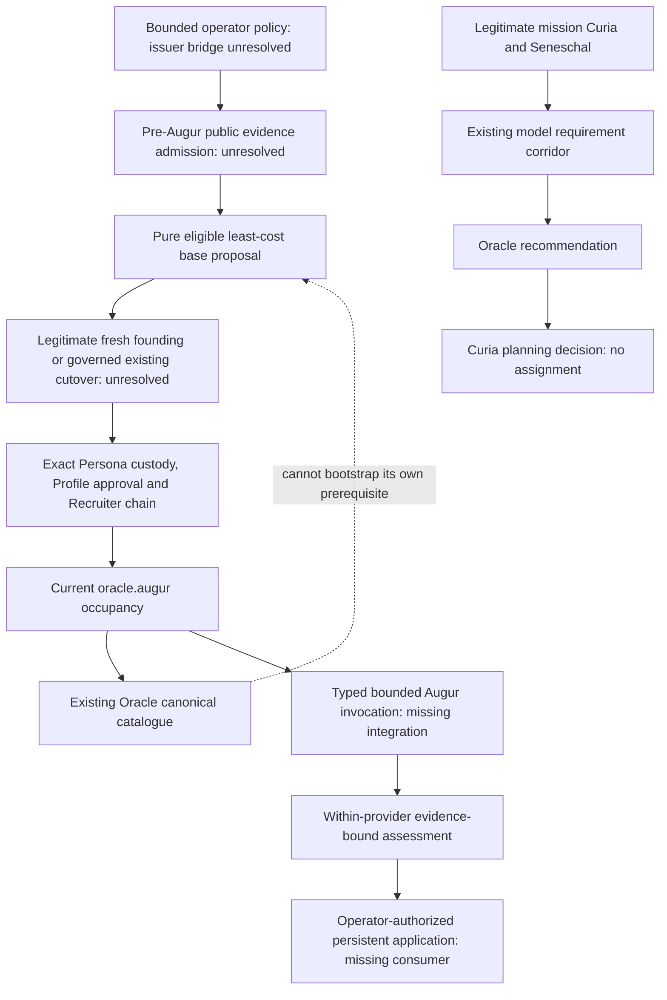

> Current status: O3 is accepted, integrated and closed. See [O3 closure](handoffs/provider-onboarding-o3-complete.md). O4-B0 is selected. The source snapshot and instructions below are historical; original approval and evidence qualifications remain intact.

# O0 prerequisite and authority map

> Current selected-route preparation and remaining dependencies are in the
> [provider closure report](handoffs/provider-onboarding-o0-provider-report.md).
> Earlier UNSELECTED/unapproved choice language below is historical where the
> selected-decision record supersedes it; it does not reopen settled choices.

> Current continuation: [independent review](reviews/provider-onboarding-o0-independent-review.md)
> verifies these bounded source findings. The [D2 proposal](provider-onboarding-authority-proposal.md)
> and [decision sheet](provider-onboarding-owner-decisions.md) now supply the
> engineering design and unapproved choices. No absent source below became
> implemented, and the O0 exit gate remains unmet.

Disposition: **PREPARED_FOR_REVIEW_WITH_EXPLICIT_AUTHORITY_BLOCKERS**.
This is source inspection at entry `6adc635ed9d89bbff7b472cc050de4c6e86d418c`,
tree `99e348854b07d9ad95d7ebaed98f6f4bbb83155e`, not installed-state evidence.
[Current acceptance](courtyard-fc-acceptance.md) controls CY/FC status;
historical pending-review qualifications remain in their original documents.
[Contract](../contracts/provider-onboarding.md) and [base policy](provider-onboarding-base-model-policy.md)
are proposed, unimplemented interfaces. The O0 implementation exit gate is not met.

## Classification and source bounds

SUPPORTED means an identified production producer and consumer implement the
stated local boundary, not that genuine inputs exist. PARTIAL means a component
exists but does not close this onboarding transition. ABSENT means no compatible
producer/consumer was found in the inspected repository source and DI, not that
one cannot exist outside this repository. DEFERRED means explicitly outside O0.
No checksum, ACTIVE label, test fixture or CLI success proves genuine competence.

Source paths in the matrix are relative to `src/Imperium/Runtime/`; links resolve
to the exact production files. Stores below describe source code only: none was
read from an installation. The review packet records entry Git blobs and SHA-256
for referenced source, required documents, configuration and inspected tests.

## Transition matrix

| ID / transition | Actual producer, store and consumer | Classification / authority gap |
| --- | --- | --- |
| P01 Provider configuration | [DeepSeekDelegateModelConfiguration::normalize](../src/Imperium/Runtime/Citadel/DeepSeekDelegateModelConfiguration.php), [DeepSeekSymfonyPlatformAdapter::invoke](../src/Imperium/Runtime/Citadel/DeepSeekSymfonyPlatformAdapter.php), [DI](../config/services.yaml): fixed legacy runtime model, temperature configuration and endpoint; no onboarding settings producer | PARTIAL. Legacy wiring is not selection of this provider. Adapter identity, provider and exact API-key route require D1; no current tariff/capability claim is inferred. |
| P02 Credential custody and access | [CredentialBroker](../src/Imperium/Runtime/LaCortine/CredentialBroker.php), [EnvironmentCredentialBroker::issue/consume](../src/Imperium/Runtime/LaCortine/EnvironmentCredentialBroker.php): process-local capabilities, `env:` reference, callback-only secret; `supportsCrossProcessCustody` false. [ProviderAccessAssertionService::assert](../src/Imperium/Runtime/Clavium/ProviderAccessAssertionService.php) writes `var/imperium/offices/clavium/provider-access-assertions` after exact legacy Locksmith binding | PARTIAL. The [environment presence probe](../src/Imperium/Runtime/Clavium/EnvironmentCredentialPresenceProbe.php) reports nonempty presence, not authenticated account access. No onboarding acquisition/refresh or durable cross-process credential bridge. `clavium://`, `env:` and FC public identifiers are different contracts; no automatic translation. |
| P03 Public catalogue | [OracleResearchCommissionService::issue/outboundRequest](../src/Imperium/Runtime/Oracle/OracleResearchCommissionService.php) requires an Imperator research authorization and Augur; [evidence admission](../src/Imperium/Runtime/Oracle/OracleResearchEvidenceAdmissionService.php) consumes Lazaretto evidence into Oracle `admitted-model-evidence` and `research-receipts`; [CanonicalCatalogueSnapshotService::seal](../src/Imperium/Runtime/Oracle/CanonicalCatalogueSnapshotService.php) reads it and access assertions; [ModelIntelligenceLedgerService::sealSnapshot](../src/Imperium/Runtime/Oracle/ModelIntelligenceLedgerService.php) writes `model-intelligence-snapshots` | PARTIAL. Canonical sealing already requires Augur stewardship. Pre-Augur public-input admission and its trust authority are ABSENT for onboarding (D2). Research authorization producer was not found in `src`; the test constructs it. |
| P04 Mechanical base selection | Catalogue facts plus bounded owner policy should produce an explanation and proposed exact binding | ABSENT. No production implementation of the [cost/eligibility algorithm](provider-onboarding-base-model-policy.md). Deterministic selection grants no research, assignment, appointment or invocation authority. |
| P05 Founding model assignment | [FoundingAugurModelAssignmentService::authorize](../src/Imperium/Runtime/Imperator/FoundingAugurModelAssignmentService.php) validates exact request and checksum of `imperium.imperator-founding-augur-model-act/v1`, actor `imperator-development-root`; writes `var/imperium/imperator/founding-augur-model-assignments` | PARTIAL. Output explicitly `PROVISIONAL_FOUNDING_EXCEPTION`; replacement requires governed Oracle evaluation. No production act producer or connection to the consumed operator-root window was found. A supplied checksum/consumed boolean does not establish authenticated owner authority or globally one-use founding consumption (D2). |
| P06 Augur Persona/Profile and assembly | [AugurResidentActivationService::activate/validate](../src/Imperium/Runtime/Conscription/AugurResidentActivationService.php) consumes exact founding assignment, Garrison admitted-held Persona, `imperium.imperator-standing-officer-profile-approval/v1` with CURRENT_ACTIVE/exact model and Persona, and legacy Recruiter assembly/binding authority; [substrate registry](../src/Imperium/Runtime/Conscription/GenericOfficerSubstrateRegistry.php) reads neutral generic-officer artifact | PARTIAL. No production producer for that exact standing-profile approval schema was found. Generic Profile approvals and formation Profiles cannot be relabeled. Actual custody/current Recruiter competence and legitimate approval chain are unresolved (D2). |
| P07 Augur occupancy/currentness | Activation writes `var/imperium/offices/oracle/occupancy`, generation 1, rejects a different existing binding; Oracle acceptance reads this binding | PARTIAL. Catalogue stewardship/commission acceptance become true; research, recommendation, selection, assignment, provider invocation and execution remain false. Exact-record replay is not replacement or a complete succession/currentness protocol. Root installation uses a different occupancy schema. |
| P08 Bounded paid Augur cognition | [GovernanceCognitionAuthorityRegistry::resolve](../src/Imperium/Runtime/Cognition/GovernanceCognitionAuthorityRegistry.php) requires exactly one resolver; [DI resolver list](../config/services.yaml) contains no Oracle resolver. [GovernanceCognitionInvoker::invoke](../src/Imperium/Runtime/Clavium/GovernanceCognitionInvoker.php) consumes native governance claims and fixed legacy adapter, not an arbitrary Augur binding | ABSENT compatible onboarding authority-to-invocation corridor. Generic infrastructure exists, but neither occupancy nor policy text grants its native claim. Need typed issuer, source/currentness resolver, resource/lease/claim consumers and approved shared custody integration (D2/D4). |
| P09 External evidence research | Oracle research emits a Sortie `external.research` request; [IronGate::dispatch](../src/Imperium/Runtime/LaCortine/IronGate.php) constructs bounded dispatch; Lazaretto is the admission boundary. DI defaults Sortie cognition to unavailable | PARTIAL, distinct from P08. Evidence collection is not paid Augur cognition authority. No provider call or external research was run. |
| P10 Requirement and evaluation | [Curia commission](../src/Imperium/Runtime/Curia/ModelRequirementCommissionService.php) requires active Seneschal even for OFFICE_SEAT; [Oracle acceptance](../src/Imperium/Runtime/Oracle/ModelRequirementCommissionAcceptanceService.php) writes acceptances; [case opening](../src/Imperium/Runtime/Oracle/ModelEvaluationCaseOpeningService.php) writes frozen cases and one-use eligibility authorities | PARTIAL for onboarding: source is a real Curia commission, not operator bootstrap policy. Additionally `freeze` requires `platform_service` and `runtime_model`, absent from ledger `validateRecord` output. The flow test supplies these directly. Production canonical catalogue-to-candidate integration is not demonstrated; a versioned adapter must preserve original records (D2 implementation prerequisite). |
| P11 Assessment/recommendation | [ModelEligibilityFindingService::issue](../src/Imperium/Runtime/Oracle/ModelEligibilityFindingService.php) uses atomic transition/immutable records, closes eligibility phase; [ModelComparativeAssessmentService::seal](../src/Imperium/Runtime/Oracle/ModelComparativeAssessmentService.php) validates evidence matrix; [ModelRecommendationService::issue](../src/Imperium/Runtime/Oracle/ModelRecommendationService.php) persists recommendation pending Curia selection | SUPPORTED local Curia-sourced record corridor, PARTIAL bootstrap integration. Caller-supplied findings/matrix are not proof of a governed model invocation. No bootstrap commission or application grant is produced. |
| P12 Apply persistent assignments | [ModelSelectionPlanningDecisionService::decide](../src/Imperium/Runtime/Curia/ModelSelectionPlanningDecisionService.php) writes proposed-model-binding, `planning_only`, requires dossier and Imperator plan review; model assignment false. [DefaultModelFallbackOrderService::issue](../src/Imperium/Runtime/Curia/DefaultModelFallbackOrderService.php) is a separate explicit Curia order with no assignment power | ABSENT operator-policy application/cutover consumer. Pending Curia selection is not settings application. Do not create a Curia for bootstrap. No automatic fallback, and Augur cannot approve its own replacement (D2/D3). |
| P13 Later Courtthane/Locksmith qualification | [FormationInstitution::witness](../src/Imperium/Runtime/Citadel/Formation/FormationInstitution.php) resolves exact original incumbents; [FormationPersonnel::candidate/appointCourtthane/currentCourtthane](../src/Imperium/Runtime/Citadel/Formation/FormationPersonnel.php) rebuilds the complete signed chain, exact Seat/effect/generation; independent Locksmith appointment remains | SUPPORTED offline software boundary; genuine evidence DEFERRED. Nine witnesses, Garrison, Guildhall, Laboratorium, four Senate findings, Lord Speaker, exact Profile approval and Recruiter qualification remain necessary. No onboarding assignment supplies those acts. |
| P14 Later formation invocation | [FormationSessionAuthority::source/validateSession](../src/Imperium/Runtime/Citadel/Formation/FormationSessionAuthority.php), [FormationPreparedOperation](../src/Imperium/Runtime/Citadel/Formation/FormationPreparedOperation.php), [FormationClaimCustodyBroker::invoke](../src/Imperium/Runtime/Clavium/FormationClaimCustodyBroker.php); aggregate session/attempt and reservation, durable delivery/consumption/dispatch, immutable envelope | SUPPORTED FC offline boundary for interview/drafting/receiving only; live DEFERRED. Not an Augur authority adapter. [Unavailable wire adapter](../src/Imperium/Runtime/Citadel/Formation/UnavailableFormationWireAdapter.php) and [transport](../src/Imperium/Runtime/Citadel/Formation/UnavailableFormationTransport.php) still refuse. B1 remains unresolved. |

## Fresh founding versus existing installation

[OperatorRootPersonnelInstallationService::install](../src/Imperium/Runtime/Bootstrap/OperatorRootPersonnelInstallationService.php)
checks `var/imperium/operator-root/operationalization-seal.json` and refuses B212
when present. It writes installation records and `imperium.operator-root-seat-occupancy/v1`;
the profile supplies authority provenance, not a legacy Augur or Locksmith occupancy.
[OperatorRootOperationalizationService::seal](../src/Imperium/Runtime/Bootstrap/OperatorRootOperationalizationService.php)
requires the founding Seat set and permanently closes the window. Its source
labels are not a claim about this installation or current live readiness.

Fresh installation: the constitutional operator-root founding power is already
defined; it does not require internal qualification of its own predecessor.
Actual operator-supplied material and a verified open window precede that act.
P05 does not itself consult that window. P06
expects a different approval/occupancy chain. No implemented bridge makes these
paths interchangeable. Supplying an operator-root Augur installation cannot
silently create legacy Augur stewardship, standing approval or access authority.

Existing installation: retain the operationalization seal, all original
installations, assignments, occupancies and consumption. Resume only a verified
retained operation or use a separately governed prospective cutover. Never delete
the seal, create a second root, replay installation, or generate another founding
exception to cure missing authority. No private-state check was performed to
classify the actual installation as fresh, occupied or sealed.

P02 adds a second dependency: legacy access assertions require a qualified
Locksmith before the base assignment, whereas the desired journey includes later
formation Locksmith qualification. These are distinct evidence contracts. An
infrastructure account-access observation may be designed later; it must not
masquerade as a Locksmith act or weaken the later appointment requirement.

## Indispensable decisions and remaining engineering

| Decision | Exact unresolved input / blocked transition | What may proceed without it |
| --- | --- | --- |
| D1 — UNSELECTED provider | Owner selects one provider and API-key route; exact adapter/model/destination support is then assessed. Legacy DeepSeek is not an implied choice | Review generic adapter/CLI contract; no authentication or implementation selection |
| D2 — UNRESOLVED authority corridor | Owner identifies or explicitly commissions the legitimate authority design for pre-Augur evidence/access admission, fresh founding versus governed existing cutover, exact standing Profile approval, bootstrap commission/paid invocation and persistent application. Need actual issuer, trust, scope, currentness, one-use and revocation consumers for each; no provisional Curia or Courtthane interview substitution | Review this graph and refusal interfaces. Engineering can specify adapters after that decision; cannot invent sovereign competence |
| D3 — UNRESOLVED policy values | Approve exact minimum Augur requirements, eligible scope, comparison workload, freshness/access rules, maximum costs/time/calls and target assignment roles/configurations. State whether bounded initial mechanical application is permitted. No defaults turn missing values into approval | Review reproducible algorithm and consent schema; leave required values unresolved |
| D4 — UNRESOLVED B1 / live contract | Selected adapter must prove accepted remote limits/usage/cancellation semantics, or owner separately amends those semantics with disclosed residual costs. Local timeout alone is insufficient | Offline contract review; default refusals and exposure retention remain |

After D2: close catalogue runtime-binding mismatch; implement authenticated
policy/evidence producers and consumers; prove exact currentness and atomic
one-use application/recovery; integrate one custody/budget domain without changing
old signed schemas. Those are future engineering tasks, not completed O0 work.
Choosing a provider or budget alone does not close D2 or authorize O1–O5.

## Evidence strength

Inspected, not rerun: [Augur activation tests](../tests/Imperium/Runtime/AugurResidentActivationServiceTest.php)
construct the founding act and standing approval directly; [Oracle research tests](../tests/Imperium/Runtime/OracleGovernedResearchFlowTest.php)
construct authorization and external returns; [Curia requirement flow tests](../tests/Imperium/Runtime/ModelRequirementCommissionFlowTest.php)
write their own canonical-looking snapshot including runtime bindings. These are
useful local consumer tests, not a genuine end-to-end onboarding proof.
Required historical sources were read in this conversation; current headers and
unchanged-body comparisons retain their separate review and test attribution.
No live claims, genuine appointments or authority are inferred from them.
